# CircuitPython Microcontrollers

CircuitPython based microcontrollers are used to integrate with sensors supporting the I2C data communication protocol.  Two [Vehicle Telemetry System](./README.md) modules currently use microcontrollers for sensor integration:

- [motion](./README-motion.md)
- [trailer](./README-trailer.md)

This ```README``` covers microcontroller software installation and configuration topics to support microcontroller/sensor applications that use USB and/or WIFI to communicate with data collection software running on a [Raspberry Pi Data Collector](./README-rpdc.md).

## Getting Started With Microcontrollers

If this is your first time working with CircuitPython, read [Getting Started](https://esp32s3.com/getting-started.html) to learn how to work with the [Unexpected Maker FeatherS3](https://esp32s3.com/feathers3.html).  You may need to upgrade the CircuitPython software on the [Unexpected Maker FeatherS3](https://esp32s3.com/feathers3.html).  The software for all CircuitPython supported microcontrollers is found at [CircuitPython downloads page](https://circuitpython.org/downloads).  This is where the [latest stable release of CircuitPython that will work with the Unexpected Maker FeatherS3](https://circuitpython.org/board/unexpectedmaker_feathers3/) can be found.

## Determining Microcontroller CircuitPython Release Number

Use either of the following sections to determine the current CircuitPython release number.  If your current release number is lower than the currently supported release number for your CircuitPython microcontroller, then you will need to upgrade your microcontroller to the latest CircuitPython for your microcontroller.

- Plug your CircuitPython microcontroller into your computer's USB port.

- NOTE: Some USB cables are charge only. **This can be frustrating!** USe a USB cable you know is good for data sync.

- [Windows **```PowerShell```** - CircuitPython Release Number](./CircuitPythonMicrocontrollers.md/#windows-powershell---circuitpython-release-number)
- [Mac, Linux and Rasbperry Pi OS **```bash shell```** - CircuitPython Release Number](./CircuitPythonMicrocontrollers.md/#mac-linux-and-rasbperry-pi-os-bash-shell---circuitpython-release-number)

### Windows **```PowerShell```** - CircuitPython Release Number

Use **```Get-Volume```** to get a list of file systems.  Look for a Drive with the **```FriendlyName```** of **```CIRCUITPY```**.  Use that drive's **```DriverLetter```** (in this case it is a **```D```**) to change the active drive.

Once in the **```CIRCUITPY```** drive, get a directory listing with **```dir```** where you will see a file by the name of **```boot_out.txt```**.  Use the **```type```** command to display the **```boot_out.txt```** contents in your **```PowerShell```** terminal window.

```powershell
PS D:\> Get-Volume

DriveLetter FriendlyName     FileSystemType DriveType HealthStatus OperationalStatus SizeRemaining     Size
----------- ------------     -------------- --------- ------------ ----------------- -------------     ----
            Windows RE Tools NTFS           Fixed     Healthy      OK                    166.24 MB   965 MB
D           CIRCUITPY        FAT            Removable Healthy      OK                     13.64 MB 13.66 MB
C           Windows          NTFS           Fixed     Healthy      OK                    821.37 GB  1.86 TB


PS C:\> D:
PS D:\> dir
    Directory: D:\
Mode                 LastWriteTime         Length Name
----                 -------------         ------ ----
d-----        12/31/1999  11:00 PM                .fseventsd
d-----        12/31/1999  11:00 PM                lib
-a----        12/31/1999  11:00 PM              0 .metadata_never_index
-a----        12/31/1999  11:00 PM              0 .Trashes
-a----        12/31/1999  11:00 PM              0 settings.toml
-a----          7/2/2025   9:31 AM           1560 code.py
-a----        12/31/1999  11:00 PM            122 boot_out.txt
-a----         6/30/2023   5:55 AM           2135 feathers3.py
-a----         6/30/2023   5:55 AM            455 test_results.txt
PS D:\> type boot_out.txt
Adafruit CircuitPython 8.1.0 on 2023-05-22; FeatherS3 with ESP32S3
Board ID:unexpectedmaker_feathers3
UID:CEADB314FBC2
PS D:\>
```

In the above example, the CircuitPython version on my [Unexpected Maker FeatherS3](https://esp32s3.com/feathers3.html) microcontroller board is **```8.1.0```**.

### Mac, Linux and Rasbperry Pi OS **```bash shell```** - CircuitPython Release Number

```bash
$ df -h
Filesystem      Size  Used Avail Use% Mounted on
udev            1.6G     0  1.6G   0% /dev
tmpfs           380M  9.3M  371M   3% /run
/dev/mmcblk0p2   58G  5.2G   50G  10% /
tmpfs           1.9G  348K  1.9G   1% /dev/shm
tmpfs           5.0M   16K  5.0M   1% /run/lock
/dev/mmcblk0p1  510M   68M  443M  14% /boot/firmware
tmpfs           380M   52K  380M   1% /run/user/1000
/dev/sda1        14M   20K   14M   1% /media/<username>/CIRCUITPY
$ cd /media/$(whoami)/CIRCUITPI
$ ls -l
total 14
-rw-r--r-- 1 lbp lbp  122 Dec 31  1999  boot_out.txt
-rw-r--r-- 1 lbp lbp 1560 Jul  2 04:31  code.py
-rw-r--r-- 1 lbp lbp 2135 Jun 30  2023  feathers3.py
drwxr-xr-x 2 lbp lbp 2048 Dec 31  1999  lib
-rw-r--r-- 1 lbp lbp    0 Dec 31  1999  settings.toml
drwxr-xr-x 2 lbp lbp 2048 Jul  1 09:54 'System Volume Information'
-rw-r--r-- 1 lbp lbp  455 Jun 30  2023  test_results.txt
$ cat boot_out.txt
Adafruit CircuitPython 8.1.0 on 2023-05-22; FeatherS3 with ESP32S3
Board ID:unexpectedmaker_feathers3
UID:CEADB314FBC2
$
```

In the above example, the CircuitPython version on my [Unexpected Maker FeatherS3](https://esp32s3.com/feathers3.html) microcontroller board is **```8.1.0```**.

## Determining The Latest Supported CircuitPython Release For Your Microcontroller Board

From the above section, [Determining Microcontroller CircuitPython Release Number](#determining-microcontroller-circuitpython-release-number), get the hardware name and currently installed release number.

In the examples above, the release number is **```8.1.0```**.

- Go to the [latest stable release of CircuitPython that will work with the Unexpected Maker FeatherS3](https://circuitpython.org/board/unexpectedmaker_feathers3/) and record the most recent available version.  Using a different microcontroller?  Go to [CircuitPython Downloads](https://circuitpython.org/downloads) and use the web page's search function to find your microcontroller.

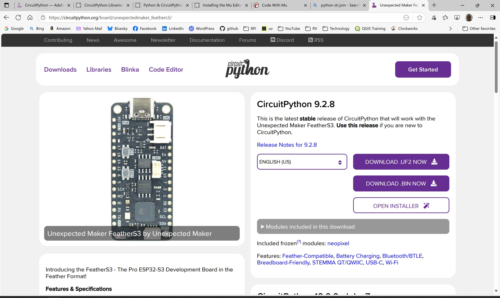

The most recent supported version is **```CircuitPython 9.2.8```**

- Compare the two versions and if there is a newer version, upgrade your microcontroller CircuitPython software

## Update CircuitPython

To update CircuitPython, go to [latest stable release of CircuitPython that will work with the Unexpected Maker FeatherS3](https://circuitpython.org/board/unexpectedmaker_feathers3/) or you can find the [CircuitPython Download Page](https://circuitpython.org/downloads) for your particular microcontroller.


- Select **```OPEN INSTALLER```** from the panel titled **```CircuitPython 9.2.8```** (or whatever is the most recent release number)

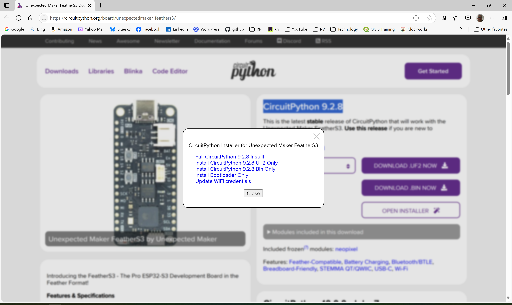

- From the popup dialog box titled **```CircuitPython Installer for Unexpected Maker FeatherS3```** (or **```CircuitPython Installer for <YOUR_DEVICE_NAME>```**), select **```Full CircuitPython 9.2.8 Install```** (or **```Full CircuitPython <VERSION_STRING> Install```**)

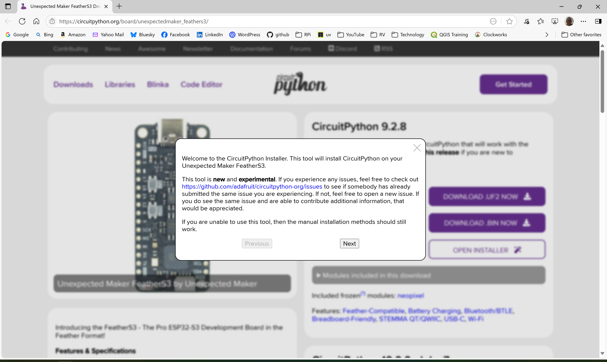

- Select **```Next```**

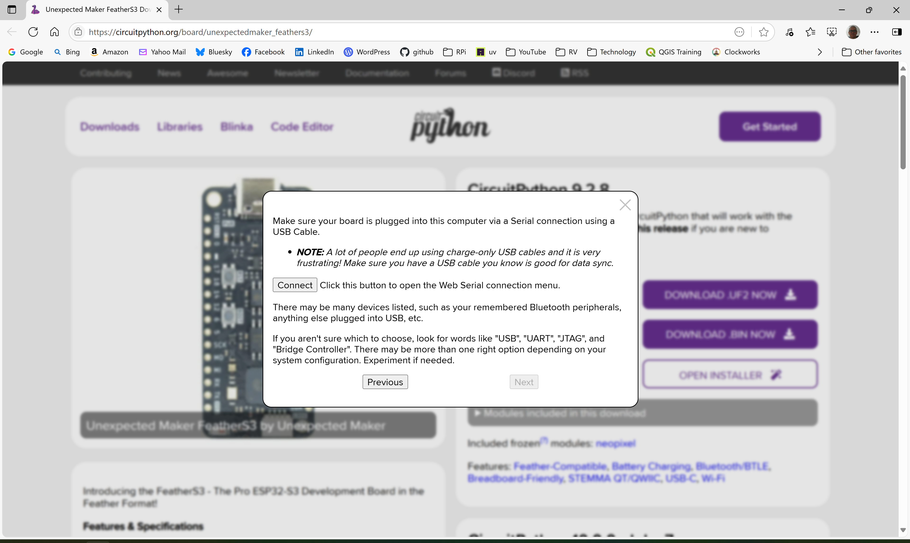

- NOTE: The FeatherS3 microcontroller must be set in debug/serial mode before the next step can work
- NOTE: **Boot FeatherS3 board into debug/serial mode by holding BOOT down and pressing the RESET button**

- Select **```Connect```**

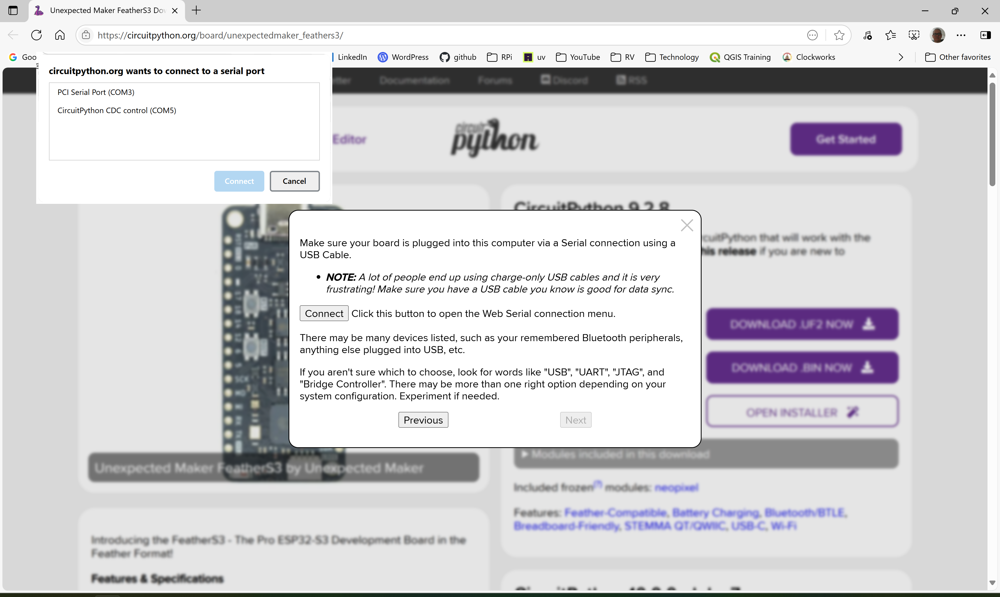

- NOTE: Dialog Box Titled **CircuitPython Wants To Connect To A Serial Port**

- NOTE: What you click on will depend on your OS and hardware configuration

- Select **```CircuitPython CDC Control (<some-COM-port>)```**

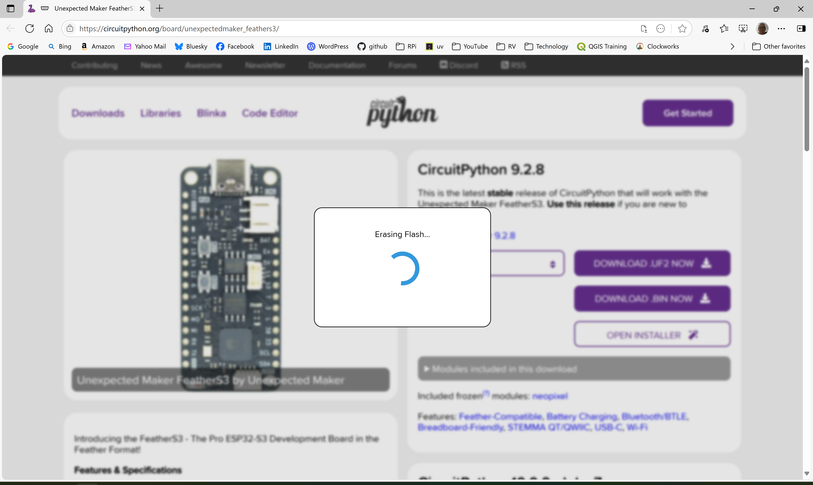

- Wait while **```Erasing Flash```**

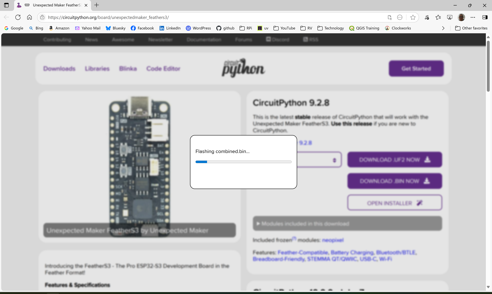

- Wait while **```Flashing...```**

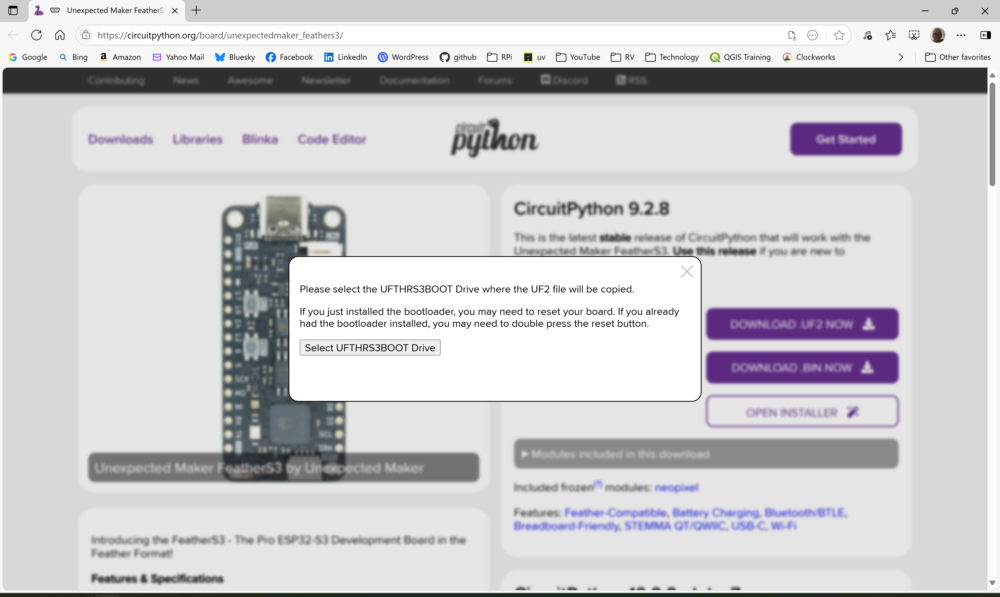

- NOTE: Dialog Box Titled **Please select the ```<microcontroller-drive>``` Drive where the UF2 file will be copied**

` Select **```Select UFTHRS3BOOT Drive```** or **```Select <microcontroller-drive> Drive```** if you are using a different microcontroller

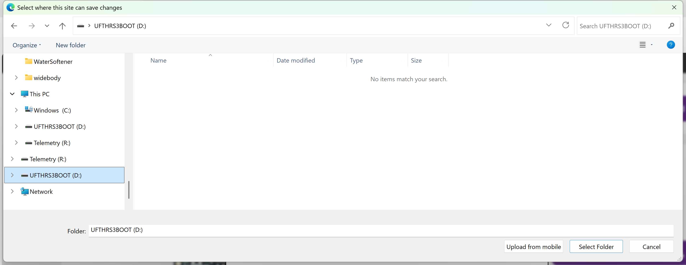

- NOTE: Dialog Box Titled **```Select where this site can save changes```**

- NOTE: From the list of drives, select the **```UFTHRS3BOOT```** or **```<microcontroller-drive>```** if you are using a different microcontroller

- Once the folder/drive is selected, click on **```Select Folder```** to continue on. 

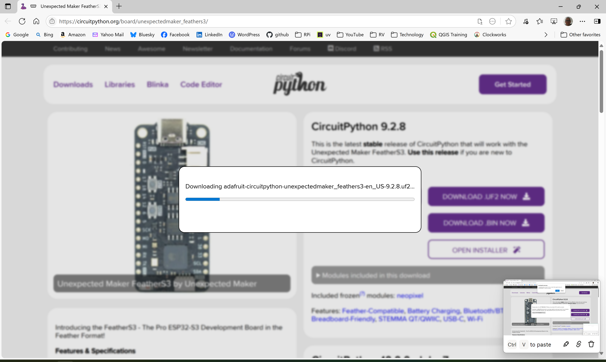

- Wait while **```Downloading...```** and **```Flashing...```**

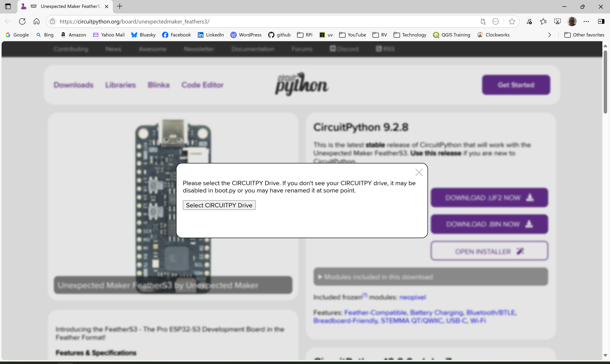

- NOTE: Dialog Box Titled **```Please seelct the CIRCUITPY Drive.  If you don't see your CIRCUITEPY drive, it may be disabled in boot.py or you may have renamed it at some point.```**

- NOTE: On some microcontrollers like the **```FeatherS3```**, the microcontroller board will need to be reset before the drive can become visible again after the last **```Flashing...```**

- NOTE: On **```FeatherS3```**, press the **```Reset Button```** labeled **```RST```** on the microcontroller board

- Select **```Select CIRCUITPY Drive```**

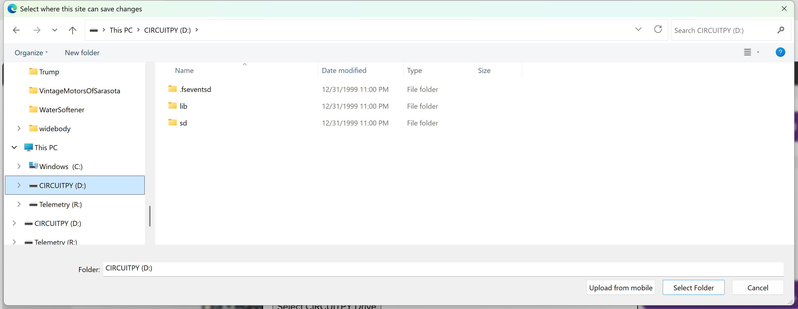

- NOTE: Dialog Box Titled **```Select where this site can save changes```**

- NOTE: From the list of drives, select the **```CIRCUITPY```**

The updates are done and you are all good to go.

Follow the instructions for [Determining Microcontroller CircuitPython Release Number](#determining-microcontroller-circuitpython-release-number).  Your results should be similar to what is shown below.

```bash
$ cat boot_out.txt
Adafruit CircuitPython 9.2.8 on 2025-05-28; FeatherS3 with ESP32S3
Board ID:unexpectedmaker_feathers3
UID:CEADB314FBC2
$
$ ls -l
total 6
drwxr-xr-x 1 runar 197609   0 Jul  3 16:30 'System Volume Information'/
-rw-r--r-- 1 runar 197609 122 Dec 31  1999  boot_out.txt
-rw-r--r-- 1 runar 197609  22 Dec 31  1999  code.py
drwxr-xr-x 1 runar 197609   0 Dec 31  1999  lib/
drwxr-xr-x 1 runar 197609   0 Dec 31  1999  sd/
-rw-r--r-- 1 runar 197609 122 Jul  3 16:31  settings.toml
$
$
```

## Creating Your Own CircuitPython Development and Test Environment

In this section, you will display the CircuitPython version running in your environment by making changes to the code on your microcontroller using the [Mu](https://codewith.mu) development environment, running the changed program and then observing the results in a console/serial window.

Before continuing, install the [Mu Editor](https://codewith.mu).  This editor, written in Python, works on Windows, Mac, Raspberry Pi and Linux based systems.  You can learn more about this editor at [Welcome To CircuitPython](https://learn.adafruit.com/welcome-to-circuitpython/installing-mu-editor).

In order to get and display the CircuitPython version running on a [Unexpected Maker FeatherS3](https://esp32s3.com/feathers3.html), you will need to make changes to code and create a console session.  Follow these steps:

- Plug the [Unexpected Maker FeatherS3](https://esp32s3.com/feathers3.html) into your computer's USB port.
- Launch [Mu](https://codewith.mu/)
- Select **Load** from the top menu bar
- Select the file ```code.py``` from the **Open File** dialog box

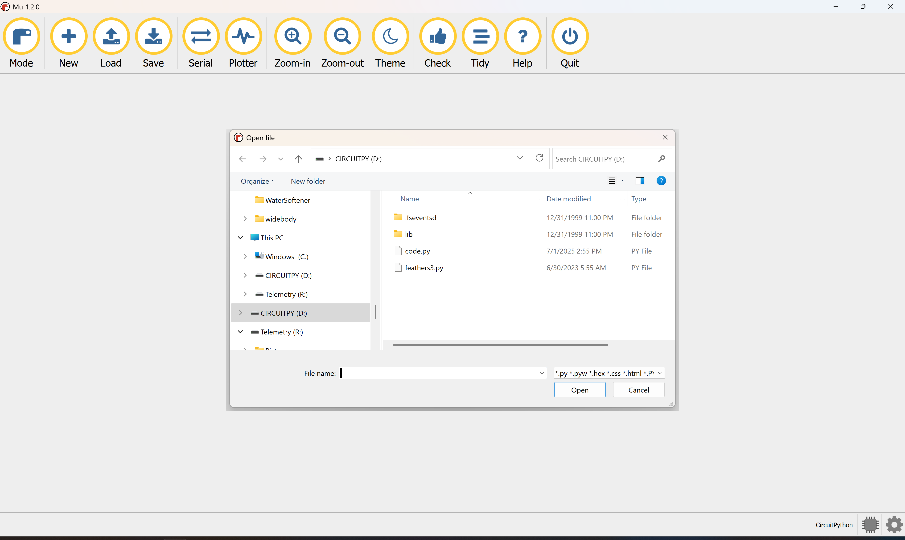

- Add additional code above line 14 ```# Show available memory```

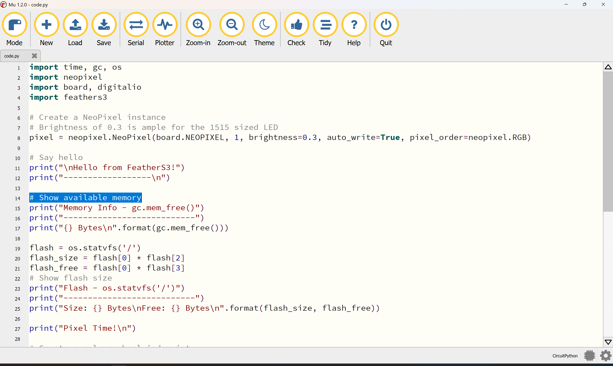

```python
# Show CircuitPython Version
import sys
print("CircuitPython Version")
print("---------------------")
print("    " + str(sys.implementation.version) + "\n")
```

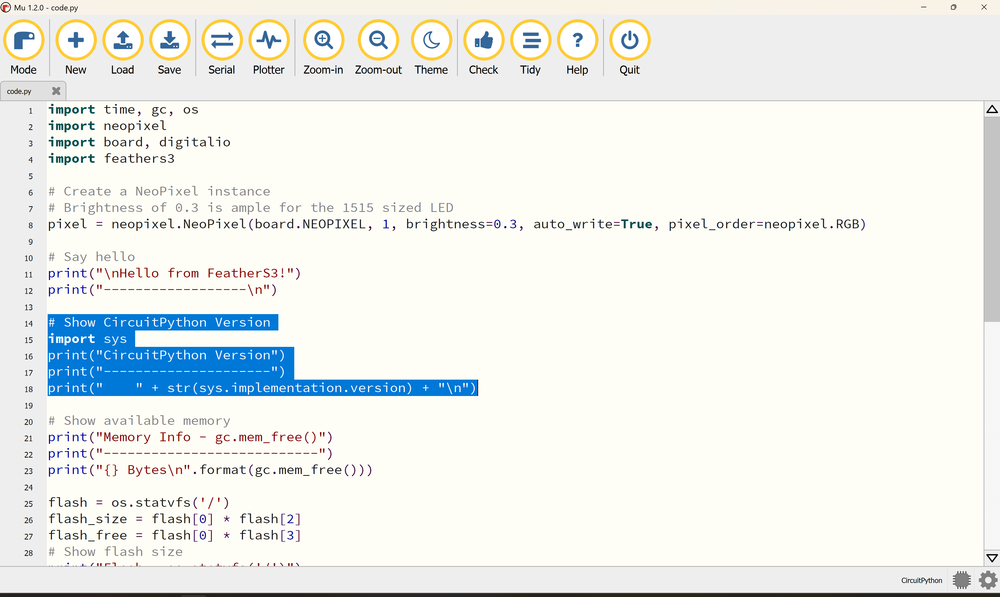

- Select **Serial** from the top menu bar

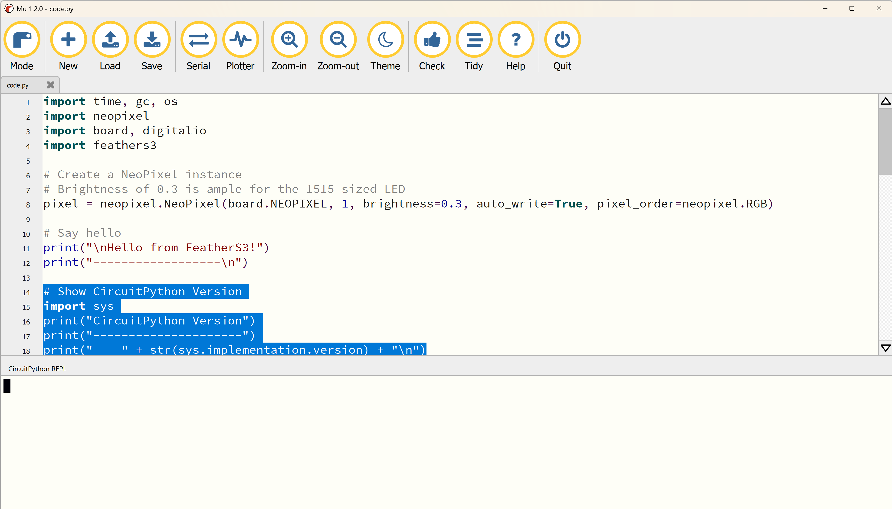

- Select **Save** from the top menu bar

  The **Save** action causes the ```code.py``` code to run with the results showing up in the [**CircuitPython REPL**](https://codewith.mu/en/tutorials/1.2/repl).

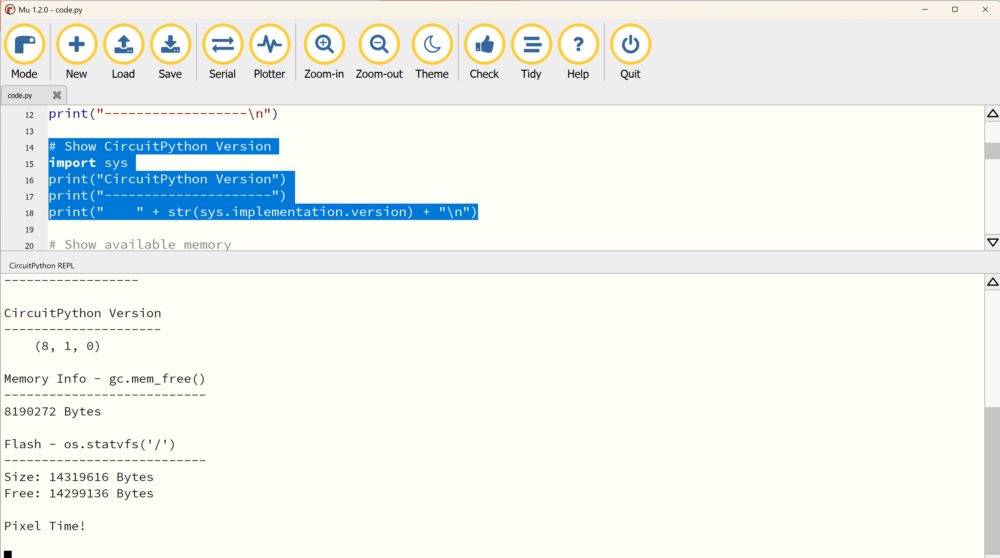

## Install Required Libraries on CircuitPython Microcontroller

By now, you should have already performed the [Python Project Software Build and Installation](./README.md#python-project-software-build-and-installation) from this project's [README](./README.md) on your desktop computer and/or Raspberry Pi.  If you haven't, do it now.

Don't use ```pip``` to install CircuitPython libraries.  Instead, use ```circup```.  ```circup``` installs and/or updates CircuitPython libraries on CircuitPython microcontrollers.  The ```circup``` utility should already be installed in your desktop computer and/or Raspberry Pi.

In the [Windows Powershell](#windows-powershell-instructions) or [Mac, Linux and Raspberry Pi Bash](#mac-linux-and-raspberry-pi-bash-instructions) instructions below, you will install the CircuitPython libraries to support both the [```trailer```](./README-trailer) and [```motion```](./README-motion.md) modules.

### Windows Powershell Instructions

Here is the summary:

```powershell
cd vehicle-telemetry-system
.\.venv\Scripts\activate
circup
circup install adafruit_itertools
circup install adafruit_bno08x
circup install adafruit_ads1x15
```

The following is the Windows output:

```powershell
> cd vehicle-telemetry-system
> .\.venv\Scripts\activate
(vehicle-telemetry-system) PS vehicle-telemetry-system> circup
Usage: circup [OPTIONS] COMMAND [ARGS]...

  A tool to manage and update libraries on a CircuitPython device.

Options:
  --verbose           Comprehensive logging is sent to stdout.
  --path DIRECTORY    Path to CircuitPython directory. Overrides automatic
                      path detection.
  --host TEXT         Hostname or IP address of a device. Overrides automatic
                      path detection.
  --port INTEGER      Port to contact. Overrides automatic path detection.
  --password TEXT     Password to use for authentication when --host is used.
                      You can optionally set an environment variable
                      CIRCUP_WEBWORKFLOW_PASSWORD instead of passing this
                      argument. If both exist the CLI arg takes precedent.
  --timeout INTEGER   Specify the timeout in seconds for any network
                      operations.
  --board-id TEXT     Manual Board ID of the CircuitPython device. If provided
                      in combination with --cpy-version, it overrides the
                      detected board ID.
  --cpy-version TEXT  Manual CircuitPython version. If provided in combination
                      with --board-id, it overrides the detected CPy version.
  --version           Show the version and exit.
  --help              Show this message and exit.

Commands:
  bundle-add     Add bundles to the local bundles list, by "user/repo"...
  bundle-remove  Remove one or more bundles from the local bundles list.
  bundle-show    Show the list of bundles, default and local, with URL,...
  example        Copy named example(s) from a bundle onto the device.
  freeze         Output details of all the modules found on the connected...
  install        Install a named module(s) onto the device.
  list           Lists all out of date modules found on the connected...
  show           Show a list of available modules in the bundle.
  uninstall      Uninstall a named module(s) from the connected device.
  update         Update modules on the device. Use --all to automatically
                 update all modules without Major Version warnings.

(vehicle-telemetry-system) PS vehicle-telemetry-system>
(vehicle-telemetry-system) PS vehicle-telemetry-system> circup install adafruit_bno08x
Uninstalled 3 packages in 169ms
Installed 3 packages in 32ms
Version 2.2.0 of circup is outdated. Version 2.2.2 was released Friday April 18, 2025.
Found device unexpectedmaker_feathers3 at D:\, running CircuitPython 9.2.8.
Downloading latest bundles for adafruit/Adafruit_CircuitPython_Bundle (20250702).
py:
Extracting:  [####################################]  100%
9.x-mpy:
Extracting:  [####################################]  100%

OK

Downloading latest bundles for adafruit/CircuitPython_Community_Bundle (20250705).
py:
Extracting:  [####################################]  100%
9.x-mpy:
Extracting:  [####################################]  100%

OK

Downloading latest bundles for circuitpython/CircuitPython_Org_Bundle (20231031.2).
py:
Extracting:  [####################################]  100%
9.x-mpy:
Extracting:  [####################################]  100%

OK

Searching for dependencies for: ['adafruit_bno08x']
Ready to install: ['adafruit_bno08x', 'adafruit_bus_device']

Installed 'adafruit_bno08x'.
Installed 'adafruit_bus_device'.

(vehicle-telemetry-system) PS vehicle-telemetry-system> 
(vehicle-telemetry-system) PS vehicle-telemetry-system> circup install adafruit_ads1x15
Uninstalled 2 packages in 7ms
Installed 1 package in 31ms
Version 2.2.0 of circup is outdated. Version 2.2.2 was released Friday April 18, 2025.
Found device unexpectedmaker_feathers3 at D:\, running CircuitPython 9.2.8.
Searching for dependencies for: ['adafruit_ads1x15']
Ready to install: ['adafruit_ads1x15', 'adafruit_bus_device']

Installed 'adafruit_ads1x15'.
'adafruit_bus_device' is already installed.

(vehicle-telemetry-system) PS vehicle-telemetry-system>
```

### Mac, Linux and Raspberry Pi Bash Instructions

The output these commands are substantively similar to the above Windows output.

```bash
cd vehicle-telemetry-system
source .venv/bin/activate
circup
circup install adafruit_itertools
circup install adafruit_bno08x
circup install adafruit_ads1x15
```

## Installing Application Software on CircuitPython Microcontroller

The following files may be installed on your CircuitPython microcontroller:

- **```boot.py```**

  Special configuration instructions that must occur at boot.  One example is to ensure that the USB connection is used as a serial communications interface.  This file is not needed if you are planning to use WIFI instead of USB.

- **```settings.toml```**

  Environment variables that can/should be set to specific values to match your configuration.  For example, WIFI SSID and password settings are stored in this file.

- **```code.py```**

  The program that uses settings information from ```settings.toml``` for configuration, interacts with a sensor and sends the sensor data to the [Raspberry Pi Data Collection](./README-rpdc.md) system via WIFI or serial (USB) link.

### [```trailer```](./README-trailer) Module

Make any desired changes to ```settings.toml```.  Any changes to this file may also need be reflected in Raspberry Pi configuration changes and/or changes in the ```trailer``` module startup script ```vehicle-telemetry-system/bin/trailer.sh```.

Plug your CircuitPython microcontroller into the USB on your Desktop or Raspberry Pi computer.  You will need to have gotten the CircuitPython directory from [Determining Microcontroller CircuitPython Release Number](#determining-microcontroller-circuitpython-release-number).  This directory is shown as ```/media/$(whoami)/CIRCUITPY``` below.

```bash
cd vehicle-telemetry-system/CircuitPython/trailer
cp boot.py /media/$(whoami)/CIRCUITPY
cp settings.toml /media/$(whoami)/CIRCUITPY
cp code.py /media/$(whoami)/CIRCUITPY
```

### [```motion```](./README-motion.md) Module

Make any desired changes to ```settings.toml```.  Any changes to this file may also need be reflected in Raspberry Pi configuration changes and/or changes in the ```motion``` module startup script ```vehicle-telemetry-system/bin/motion-WIFI.sh```.

Plug your CircuitPython microcontroller into the USB on your Desktop or Raspberry Pi computer.  You will need to have gotten the CircuitPython directory from [Determining Microcontroller CircuitPython Release Number](#determining-microcontroller-circuitpython-release-number).  This directory is shown as ```/media/$(whoami)/CIRCUITPY``` below.

### WIFI Version

```bash
cd vehicle-telemetry-system/CircuitPython/motion
cp boot.py /media/$(whoami)/CIRCUITPY
cp settings.toml /media/$(whoami)/CIRCUITPY
cp wifi_code.py /media/$(whoami)/CIRCUITPY/code.py
```

### USB Version

```bash
cd vehicle-telemetry-system/CircuitPython/motion
cp boot.py /media/$(whoami)/CIRCUITPY
cp settings.toml code.py /media/$(whoami)/CIRCUITPY
cp usb_code.py /media/$(whoami)/CIRCUITPY/code.py
```
