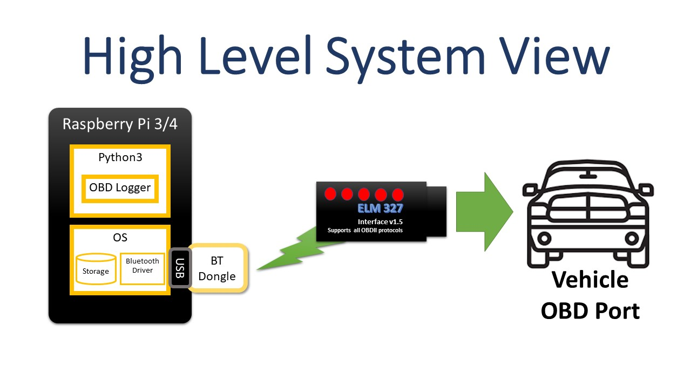
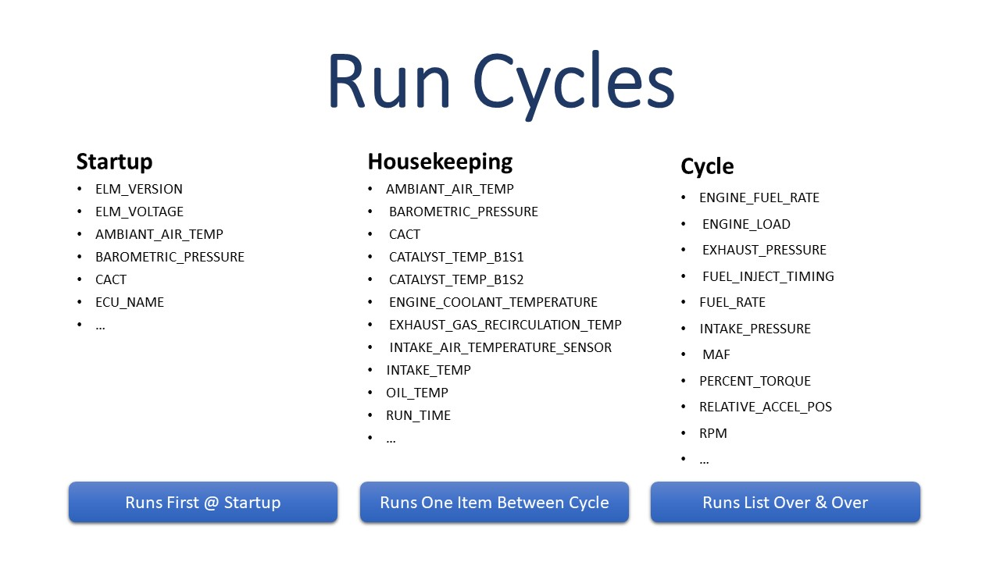

# Vehicle Telemetry System - Engine Module

The **engine** module, also known as **Telemetry OBD Logger** captures vehicle performance data using an OBD interface device attached to the vehicle.  While the logger is running, it writes output to files.  Data from multiple vehicles can easily be logged.  Data from each different vehicle is stored in a directory/folder matching the vehicle's VIN or vehicle identification number.

The software sends _OBD Commands_ to the engine.  The engine responds to supported commands and ignores unsupported commands.  This software and the underlying library supporting this software ([python-OBD](https://github.com/brendan-w/python-OBD)) use names like ```SPEED``` instead of the binary numbers ```0x0D``` that the OBD standard ([J1979-DA, Digital Annex of E/E Diagnostic Test Modes J1979DA_202104](https://www.sae.org/standards/content/j1979da_202104/)) uses.

The software is designed to run on Raspberry Pi with Raspberry Pi OS (formerly known as Raspbian) installed.  Bluetooth capabilities are used by a Bluetooth Adapter and must be correctly configured before this software module can function.  See [Bluetooth Installation and Configuration](./docs/README-bluetooth.md) for more information.



## OBD Logger

### Command Line Usage

The Telemetry OBD Logger application command line interface (CLI) is as follows:

```bash
$ python3.11 -m telemetry_obd.obd_logger --help
usage: obd_logger.py [-h] [--config_file CONFIG_FILE] [--config_dir CONFIG_DIR] [--full_cycles FULL_CYCLES] [--timeout TIMEOUT] [--logging] [--no_fast]
                     [--verbose]
                     [--version]
                     [base_path]

Telemetry OBD Logger

positional arguments:
  base_path             Relative or absolute output data directory. Defaults to 'data'.

options:
  -h, --help            show this help message and exit
  --config_file CONFIG_FILE
                        Settings file name. Defaults to '<vehicle-VIN>.ini' or 'default.ini'.
  --config_dir CONFIG_DIR
                        Settings directory path. Defaults to './config'.
  --full_cycles FULL_CYCLES
                        The number of full cycles before a new output file is started. Default is 50.
  --timeout TIMEOUT     The number seconds before the current command times out. Default is 1.0 seconds.
  --logging             Turn on logging in python-obd library. Default is off.
  --no_fast             When on, commands for every request will be unaltered with potentially long timeouts when the car doesn't respond promptly or at
                        all. When off (fast is on), commands are optimized before being sent to the car. A timeout is added at the end of the command.
                        Default is off.
  --output_file_name_counter
                        Base output file name on counter not timestamps
  --verbose             Turn verbose output on. Default is off.
  --version             Print version number and exit.
$
```

#### ```--timeout TIMEOUT```

The timeout value determines how long a read request can take between the underlying ```python-OBD``` library and the OBD reader device.  If one or more individual commands are causing problems by intermittently responding with ```"no response"``` instead of a real value, an increase in the ```timeout``` value may help alleviate the problem.

#### ```--no_fast```

```--no_fast``` can also be used to reduce the number of ```"no response"```s but be aware of the consequences.  For commands that are not available on the vehicle being instrumented, the software may just wait forever for a response that will never come.

#### ```--version```

Responds with the version and exits.

#### Telemetry OBD Logger Run Cycles

While logging, OBD Logger submits a pattern of OBD commands to the vehicle and stores the vehicle's responses.  There are three patterns:

- Startup
- Housekeeping
- Cycle



##### Startup

The startup list of OBD commands is only executed when the program starts up.  Typically, this list of OBD commands includes:

- OBD commands whose return values never change (e.g. ```ECU_NAME```, ```ELM_VERSION```, ```ELM_VOLTAGE```)
- OBD commands with slow changing return values that might be needed for startup baseline like ```AMBIANT_AIR_TEMP``` and ```BAROMETRIC_PRESSURE```.

##### Housekeeping

A list of OBD commands that have ("relatively") "slow changing" return values such as  ```AMBIANT_AIR_TEMP``` and ```BAROMETRIC_PRESSURE```.  These are commands that need to be run over and over again but in a slower loop.

##### Cycle

A list of OBD commands that have fast changing return values such as ```RPM```, ```MAF``` (Mass Air Flow) and ```PERCENT_TORQUE```.  The idea is for these commands to run over and over again in relatively fast loops.

##### Full Cycle

The repeating part of the OBD command pattern is called a "full cycle" and has OBD commands from Cycle executed in a group followed by the next Housekeeping command.  This basic pattern repeats over and over.  When the end of the Housekeeping commands is reached, a "Full Cycle" has been achieved.

The total number of command submissions in a full cycle is the ```count of commands in Housekeeping``` times (one plus the ```count of commands in Cycle```).

The ```--full_cycles``` parameter is used to set the number of ```full_cycles``` contained in output data files.  Once the ```--full_cycles``` limit is reached, the data file is closed and a new one is opened.  This keeps data loss from unplanned Raspberry Pi shutdowns to a minimum.  In practice, this hasn't been used since each write is followed by an operating system call causing data file writes to be written to disk (and not buffered) before the program can continue.

#### Telemetry OBD Logger Configuration Files

Configuration files are used to tell OBD Logger what OBD commands to send the vehicle and the order to send those commands in.  A sample configuration file is shown below and another one is included in the source code.

##### Default Configuration File

A default configuration file is included in the repository at ```config/default.ini```.  This configuration file contains most OBD commands.  There are wide variations in supported command sets by manufacturer, model, trim level and year.  By starting out with this configuration file, OBD Logger will try all commands.  After a full cycle is run, unsupported commands will respond with ```"obd_response_value": "no response"``` in the output data.  

Some commands will result in an OBD response value of ```"no response"``` (```"obd_response_value": "no response"```) when the vehicle is unable to satisfy the OBD data request quickly enough.  You can identify this problem by searching for all responses for a particular command and seeing if sometimes the command responds with ```"no response"``` or with a value.

For example, 2017 Ford F-450 truck ```FUEL_RATE``` command in the ```cycle``` section of the configuration file returned mixed results.  In 1,124 attempts, 1084 responded with a good value while 40 responded with ```no response```.

```bash
human@computer:data/FT8W4DT5HED00000$ grep FUEL_RATE <VIN>-20210910204443-utc.json | grep "no response" | wc -l
40
human@computer:data/FT8W4DT5HED00000$ grep FUEL_RATE <VIN>-20210910204443-utc.json | grep -v "no response" | wc -l
1084
```

This problem may be solved by increasing the OBD command timeout from its default to a higher value.  Use the ```--timeout``` setting when invoking the ```obd_logger``` command.

### All Output Data Files Regardless of Module

Output data files are in a hybrid format.  Data files contain records separated by line feeds (```LF```) or carriage return and line feeds (```CF``` and ```LF```).  The records themselves are formatted in JSON.  Sample output follows:

```json
{"command_name": "AMBIANT_AIR_TEMP", "obd_response_value": "25 degC", "iso_ts_pre": "2020-09-09T15:38:29.114895+00:00", "iso_ts_post": "2020-09-09T15:38:29.185457+00:00"}<CR>
{"command_name": "BAROMETRIC_PRESSURE", "obd_response_value": "101 kilopascal", "iso_ts_pre": "2020-09-09T15:38:29.186497+00:00", "iso_ts_post": "2020-09-09T15:38:29.259106+00:00"}<CR>
{"command_name": "CONTROL_MODULE_VOLTAGE", "obd_response_value": "0.0 volt", "iso_ts_pre": "2020-09-09T15:38:29.260143+00:00", "iso_ts_post": "2020-09-09T15:38:29.333047+00:00"}<CR>
{"command_name": "VIN", "obd_response_value": "TEST_VIN_22_CHARS", "iso_ts_pre": "2020-09-09T15:38:30.029478+00:00", "iso_ts_post": "2020-09-09T15:38:30.061014+00:00"}
{"command_name": "FUEL_STATUS", "obd_response_value": "no response", "iso_ts_pre": "2020-09-09T15:38:29.771997+00:00", "iso_ts_post": "2020-09-09T15:38:29.824129+00:00"}
```

#### JSON Fields

- ```command_name```
  OBD command name submitted to vehicle.

- ```obd_response_value```
  OBD response value returned by the vehicle.  When the OBD command gets no response, the response is ```"no response"```.  Response values are either a string like ```"no response"``` and ```"TEST_VIN_22_CHARS"``` or they are a [Pint](https://pint.readthedocs.io/en/stable/) encoded value like ```"25 degC"``` and ```"101 kilopascal"```.

  Some OBD commands will respond with multiple values in a list.  The values within the list can also be Pint values.  This works just fine in JSON but the code reading these output files will need to be able to manage embedded lists within the response values.  [Telemetry OBD Data To CSV File](https://github.com/thatlarrypearson/telemetry-obd-log-to-csv) contains two programs, ```obd_log_evaluation``` and ```obd_log_to_csv```, providing good examples of how to handle multiple return values.

- ```iso_ts_pre```
  ISO formatted timestamp taken before the OBD command was issued to the vehicle (```datetime.isoformat(datetime.now(tz=timezone.utc))```).

- ```iso_ts_post```
  ISO formatted timestamp taken after the OBD command was issued to the vehicle (```datetime.isoformat(datetime.now(tz=timezone.utc))```).

[Pint](https://pint.readthedocs.io/en/stable/) encoded values are strings with a numeric part followed by the unit.  For example, ```"25 degC"``` represents 25 degrees Centigrade.  ```"101 kilopascal"``` is around 14.6 PSI (pounds per square inch).  Pint values are used so that the units are always kept with the data and so that unit conversions can easily be done in downstream analysis software.  These strings are easy to deserialize to Pint objects for use in Python programs.

### Telemetry OBD Logger Debug Output

OBD Logger provides additional information while running when the ```--verbose``` option is used.  Additionally, The underlying python ```obd``` library (```python-obd```) supports detailed low-level logging capabilities which can be enabled within OBD Logger with the ```--logging``` option.

Sample ```--logging``` output follows:

```text
[obd.obd] ======================= python-OBD (v0.7.1) =======================
INFO:obd.obd:======================= python-OBD (v0.7.1) =======================
[obd.obd] Using scan_serial to select port
INFO:obd.obd:Using scan_serial to select port
[obd.obd] Available ports: ['/dev/rfcomm0']
INFO:obd.obd:Available ports: ['/dev/rfcomm0']
[obd.obd] Attempting to use port: /dev/rfcomm0
INFO:obd.obd:Attempting to use port: /dev/rfcomm0
[obd.elm327] Initializing ELM327: PORT=/dev/rfcomm0 BAUD=auto PROTOCOL=auto
INFO:obd.elm327:Initializing ELM327: PORT=/dev/rfcomm0 BAUD=auto PROTOCOL=auto
[obd.elm327] Response from baud 38400: b'\x7f\x7f\r?\r\r>'
DEBUG:obd.elm327:Response from baud 38400: b'\x7f\x7f\r?\r\r>'
[obd.elm327] Choosing baud 38400
DEBUG:obd.elm327:Choosing baud 38400
[obd.elm327] write: b'ATZ\r'
DEBUG:obd.elm327:write: b'ATZ\r'
[obd.elm327] wait: 1 seconds
DEBUG:obd.elm327:wait: 1 seconds
[obd.elm327] read: b'ATZ\r\r\rELM327 v1.5\r\r>'
DEBUG:obd.elm327:read: b'ATZ\r\r\rELM327 v1.5\r\r>'
[obd.elm327] write: b'ATE0\r'
DEBUG:obd.elm327:write: b'ATE0\r'
[obd.elm327] read: b'ATE0\rOK\r\r'
DEBUG:obd.elm327:read: b'ATE0\rOK\r\r'
[obd.elm327] write: b'ATH1\r'
DEBUG:obd.elm327:write: b'ATH1\r'
[obd.elm327] read: b'OK\r\r>'
DEBUG:obd.elm327:read: b'OK\r\r>'
[obd.elm327] write: b'ATL0\r'
```

### OBD Logger Data File Naming Convention

See [Telemetry System Boot and Application Startup Counter](./README-audit.md).

## Testing All Available OBD Commands To See Which Ones Work On Your Vehicle

```Telemetry OBD Command Tester``` can be used to determine which set of OBD commands are supported by a given vehicle.

```bash
$ python3.11 -m telemetry_obd.obd_command_tester --help
usage: obd_command_tester.py [-h] [--base_path BASE_PATH] [--cycles CYCLES] [--timeout TIMEOUT] [--logging] [--no_fast] [--verbose]

Telemetry OBD Command Tester

optional arguments:
  -h, --help            show this help message and exit
  --base_path BASE_PATH
                        Relative or absolute output data directory. Defaults to 'data'.
  --cycles CYCLES       The number of cycles before ending. A cycle consists of all known OBD commands. Default is 10.
  --timeout TIMEOUT     The number seconds before a command times out. Default is 0.5 seconds.
  --logging             Turn on logging in python-obd library. Default is off.
  --no_fast             When on, commands for every request will be unaltered with potentially long timeouts when the car
                        doesn't respond promptly or at all. When off (fast is on), commands are optimized before being
                        sent to the car. A timeout is added at the end of the command. Default is off so fast is on.
  --output_file_name_counter
                        Base output file name on counter not timestamps
  --verbose             Turn verbose output on. Default is off.
```

The output file format is the same as ```telemetry_obd.obd_logger``` as are many of the command line arguments.  ```--cycles``` determines the number of times the full list of known OBD commands is tried.  The OBD command list needs to be run a number of times because vehicles don't alway respond to requests in a timely manner providing ambiguous results.

Test output files are named differently than ```obd_logger``` data files.  See [Data File Naming Conventions](./README-audit.md/#data-file-naming-conventions).

## Issues Surfaced During Vehicle Testing

*IMPORTANT!*   Some vehicle identification numbers (VIN) are known to drop characters when being recorded.  Not to worry as the recorded VIN is still *VERY* *UNLIKELY* to overlap with another vehicle's VIN (unless you are working with thousands of vehicles).  VIN data is provided by the ```python-obd``` library.

* 2017 Ford F-450 VIN is missing leading ```1``` digit/letter
  * ```1FT8W4DT5HED00000``` is recorded as ```FT8W4DT5HED00000```
* 2013 Jeep Wrangler Rubicon VIN is missing leading ```1```  and trailing 2 digits/letters
  * ```1C4HJWCG5DL500000``` is recorded as  ```C4HJWCG5DL5000```
* 2021 Toyota Sienna Hybrid LE is missing the trailing ```0``` digit/letter
  * ```5TDKRKEC3MS042260``` is recorded as ```5TDKRKEC3MS04226```

*IMPORTANT!* Calibration Verification Numbers (CVN) come in 4 byte sets.  Multiple CVN (more than 4) can be returned through a single CVN command.  As a result, the CVN data isn't likely to be valid as provided by the ```python-obd``` library.

*IMPORTANT!* Calibration IDs (CALIBRATION_ID) come in 16 byte sets.  Multiple CALIBRATION_ID (more than 4) can be returned through a single CALIBRATION_ID command.  As a result, the CALIBRATION_ID data isn't likely to be valid as provided by the ```python-obd``` library.

Problems like the above can be found by running ```telemetry_obd.obd_logger``` and ```telemetry_obd.obd_command_tester``` with the ```--logging``` and ```--verbose``` command line arguments.  Look for "```DEBUG:obd.OBDCommand:Message was longer than expected```" in the output.

## Configuration File Creation and Validation

When a VIN (vehicle identification number) specific configuration file doesn't exist, the OBD Logger program defaults to using the ```"default.ini"``` configuration file.  This file, included in the software distribution under ```"config/default.ini"``` contains most known OBD commands.  Because of the wide variations in supported command sets by manufacturer, model, trim level and year made, it is difficult to know what OBD commands a specific car will respond to. Additionally, manufacturers don't typically publish lists of valid OBD commands for each vehicle sold.  This "try-them-all" method seems to be the only approach to identifying which OBD commands a specific vehicle will respond to.

The preferred way to **"try-them-all"**, that is try every known OBD command, is to use the ```telemetry_obd.obd_command_tester``` program. Once all the possible known OBD commands have been tried, it becomes possible to create a list of valid known commands to be used in the creation of a vehicle specific configuration file.  The OBD Logger software was written to automatically choose configuration files appropriately named ```"<VIN>.ini"``` by default.  If the ```"<VIN>.ini"``` isn't available, then the other default, ```"default.ini"```, is chosen.

Analysis of ```telemetry_obd.obd_command_tester``` and ```telemetry_obd.obd_logger``` output is done by ```telemetry_obd_log_to_csv.obd_log_evaluation``` found in [Aggregation](./README-aggregation.md).

When creating vehicle specific configuration files, use ```obd_log_evaluation``` to determine the list of commands providing valid vehicle responses.  Only valid OBD commands should be used long term when gathering vehicle data.

## Manufacturer Warranty Information

The 2019 Ford EcoSport manual and other vehicles have the following statement or something similar with respect to aftermarket OBD devices:

- "Your vehicle has an OBD Data Link Connector (DLC) that is used in conjunction with a diagnostic scan tool for vehicle diagnostics, repairs and reprogramming services. Installing an aftermarket device that uses the DLC during normal driving for purposes such as remote insurance company monitoring, transmission of vehicle data to other devices or entities, or altering the performance of the vehicle, may cause interference with or even damage to vehicle systems. We do not recommend or endorse the use of aftermarket plug-in devices unless approved by Ford. The vehicle Warranty will not cover damage caused by an aftermarket plug-in device."

You use this software at your own risk.

## LICENSE

[MIT License](./LICENSE.md)
