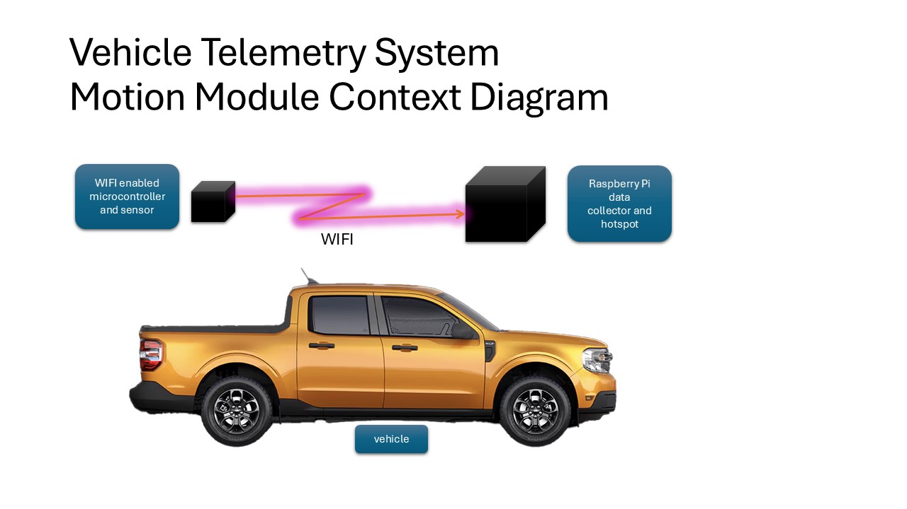
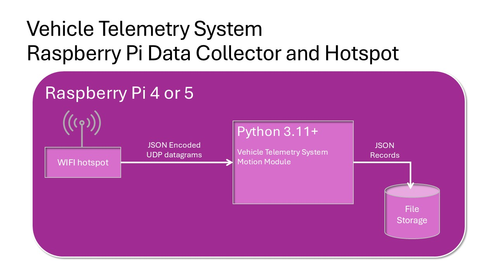
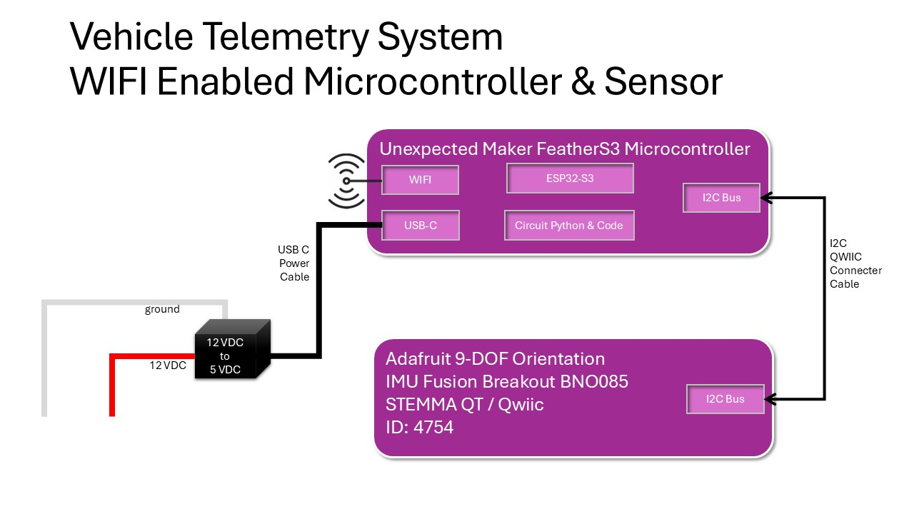
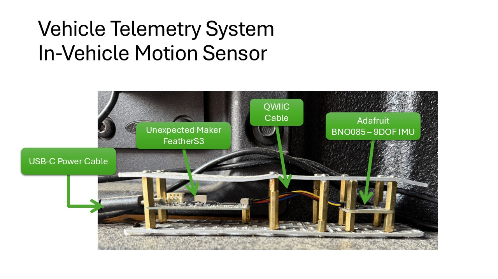
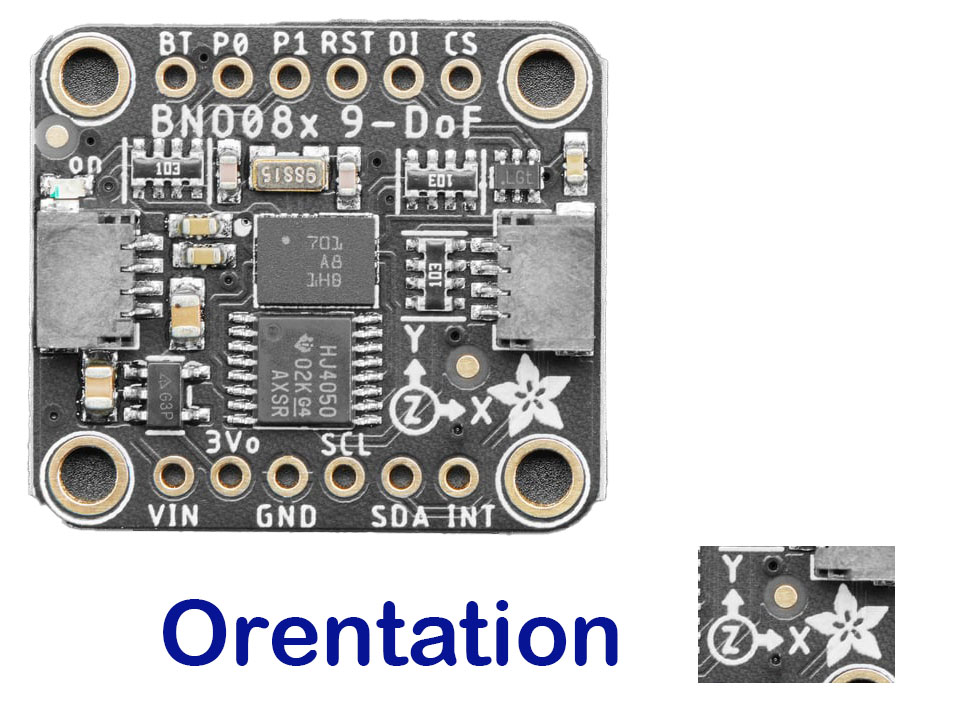

# Telemetry Motion Logging

Logs 9 DOF (degrees of freedom) IMU (inertial motion unit) captured by [ESP32-S3 processor](https://en.wikipedia.org/wiki/ESP32#ESP32-S3) based [CircuitPython](https://circuitpython.org/) enabled feather micro-controller connected to [I2C enabled 9 DOF IMU feather wing](https://www.adafruit.com/product/4754).

## Motivation

Integrate motion data with vehicle engine and location data for better, more accurate analytics.

In this application, 9 DOF (degrees of freedom) IMUs (inertial motion units) measure and report vehicle acceleration, angular rate, and compass heading using a combination of sensors like accelerometers and gyroscopes. That is, IMUs are used to report an object's orientation, velocity, and position changes in 3D space.

## Context

Data from a 9-DOF IMU provides a comprehensive understanding of an object's motion from a [Physics Kinematics](https://simple.wikipedia.org/wiki/Kinematics) perspective.  This includes its orientation (compass heading, roll, pitch and yaw) and acceleration in 3D space.

This data can explain, to some degree, what is happening in the physical world as a vehicle travels over a roadway.  It it going up or down a hill.  Is the vehicle leaning to the left or right?  Going around a corner?  Accelerating rapidly or performing a panic stop.  Depending on the vehicle and sensor placement, one might even be able to tell what the vehicle's load is.

Measures the strength and direction of the magnetic field in three axes (X, Y, and Z), often used as a compass to determine heading.

By combining the data from these three sensors, a 9-DOF IMU can provide a comprehensive understanding of an object's motion, including its orientation (yaw, pitch, and roll) and acceleration in 3D space. This is useful in a variety of applications, such as robotics, drones, virtual reality, and wearable technology.

## Context Diagram



## Features

This solution provides:

- Three axes of acceleration (gravity + linear motion) in m/s^2

- Three axes of linear acceleration data (acceleration minus gravity) in m/s^2

- Three axes of gravitational acceleration (minus any movement) in m/s^2

- Magnetic Field Strength Vector / Magnetometer - Three axes of magnetic field sensing in micro Tesla (uT)

- Three axes of 'rotation speed' in rad/s

- Absolute Orientation / Rotation Vector - Four point quaternion output for accurate data manipulation

- Roll, pitch and yaw in radians

## Target Hardware

The [Raspberry Pi Data Collector](./README-rpdc.md) and Hotspot hardware is a Raspberry Pi 4 or 5 with 4 GB RAM (or more) and with a 32 GB (or more) SD card running Raspberry Pi OS with the latest ```bookworm``` release installed.



A microcontroller ([Unexpected Maker FeatherS3](https://esp32s3.com/feathers3.html)) running [CircuitPython](https://circuitpython.org) is connected via I2C to a sensor ([Adafruit 9-DOF Orientation IMU Fusion Breakout - BNO085 (BNO080) - STEMMA QT / Qwiic](https://www.adafruit.com/product/4754)).



The USB interface to the [Unexpected Maker FeatherS3](https://esp32s3.com/feathers3.html) is used for 5 volt power as shown above.  For this configuration, WIFI is used for data transport connecting the microcontroller/sensor to the [Raspberry Pi Data Collector](./README-rpdc.md).

Alternatively, the microcontroller can be connected directly to the Raspberry Pi Data Collector's USB.  That is, USB can be used for data transport.  However, during initial testing microcontroller/sensor placement in the vehicle was an issue.  The sensor moved around in the vehicle making data analysis more difficult.

After switching to WIFI, the microcontroller/sensor was fixed securely to a painted surface using two-sided tape as shown below.



When mounting the microcontroller and sensor in the vehicle, be sure to orient the sensor flat to the floor of the vehicle (truck bed) with the x axis arrow pointing straight ahead.  Don't worry if it isn't exactly straight.



The image above shows the [I2C enabled 9 DOF IMU feather wing](https://www.adafruit.com/product/4754) with an image of the orientation printed on the board overlaid on the image.  ```x``` should be forward making positive ```y``` to the left and positive ```z``` up.

## Microcontroller System and Application Software

CircuitPython based microcontrollers are used to integrate with sensors supporting the I2C data communication protocol.  This module uses microcontrollers for sensor integration.

[CircuitPython Microcontrollers](./CircuitPythonMicrocontrollers.md) covers microcontroller software installation and configuration topics to support microcontroller/sensor applications that use USB and/or WIFI to communicate with data collection software running on a [Raspberry Pi Data Collector](./README-rpdc.md).

Read and follow [CircuitPython Microcontrollers](./CircuitPythonMicrocontrollers.md) before attempting to integrate your microcontroller/sensor into this project.

## Usage

This is the data collection software that runs on your in vehicle [Raspberry Pi Data Collector](./README-rpdc.md).

```bash
$ uv run -m imu_logger.imu_logger --help
usage: imu_logger.py [-h] [--usb] [--serial_device_name SERIAL_DEVICE_NAME] [--no_wifi] [--upp_port_number UPP_PORT_NUMBER] [--verbose] [--version]
                     [base_path]

Telemetry IMU Logger

positional arguments:
  base_path             Relative or absolute output data directory. Defaults to '/home/lbp/telemetry-data/data'.

options:
  -h, --help            show this help message and exit
  --usb                 CircuitPython microcontroller connects via USB is True. Default is False.
  --serial_device_name SERIAL_DEVICE_NAME
                        Name for the hardware IMU serial device. Defaults to None
  --no_wifi             CircuitPython microcontroller does NOT use WIFI to connect. Default is False
  --udp_port_number UPP_PORT_NUMBER
                        TCP/IP UDP port number for receiving datagrams. Defaults to '50224'
  --verbose             Turn DEBUG logging on. Default is off.
  --version             Print version number and exit.
$
```

## Sample Log Data

See [Data](./README.md/#data) for a general description and discussion of the log data format.

```json
{
  "command_name": "acceleration",
  "obd_response_value": {
    "record_number": 493,
    "x": -0.160156,
    "y": -0.246094,
    "z": 9.74609
  },
  "iso_ts_pre": "2025-05-17T17:23:09.996770+00:00",
  "iso_ts_post": "2025-05-17T17:23:10.825158+00:00"
}
{
  "command_name": "gravity", 
  "obd_response_value": {
    "record_number": 493,
    "x": -0.148438,
    "y": -0.28125,
    "z": 9.72656
  },
  "iso_ts_pre": "2025-05-17T17:23:10.829531+00:00",
  "iso_ts_post": "2025-05-17T17:23:10.829674+00:00"
}
{
  "command_name": "gyroscope",
  "obd_response_value": {
    "record_number": 493,
    "x": 0.00390625,
    "y": 0.0,
    "z": -0.00195313
  },
  "iso_ts_pre": "2025-05-17T17:23:10.834484+00:00",
  "iso_ts_post": "2025-05-17T17:23:10.866375+00:00"
}
{
  "command_name": "linear_acceleration",
  "obd_response_value": {
    "record_number": 493,
    "x": 0.0273438,
    "y": 0.0273438,
    "z": -0.0234375
  },
  "iso_ts_pre": "2025-05-17T17:23:10.871766+00:00",
  "iso_ts_post": "2025-05-17T17:23:10.871887+00:00"
}
{
  "command_name": "magnetometer",
  "obd_response_value": {
    "record_number": 493,
    "x": 94.5625,
    "y": -28.8125,
    "z": 50.3125
  },
  "iso_ts_pre": "2025-05-17T17:23:10.878966+00:00",
  "iso_ts_post": "2025-05-17T17:23:10.892621+00:00"
}
{
  "command_name": "rotation_vector",
  "obd_response_value": {
    "record_number": 493,
    "vector": [-0.0150146, -0.00549316, 0.738342, 0.674255],
    "roll": 1.661261158154104,
    "pitch": 0.014764774838934513,
    "yaw": -3.1132274490200587
  },
  "iso_ts_pre": "2025-05-17T17:23:10.896280+00:00",
  "iso_ts_post": "2025-05-17T17:23:10.918634+00:00"
}
```

## Log Data Description - ```obd_response_value```

See [Data](./README.md/#data) for a general description and discussion of the log data format.

In this module, ```obd_response_value``` is a JSON encoded Python dictionary.  Each of the different ```command_name```s contains the ```key``` of ```record_number``` that contains a monotonically increasing integer value representing the number of times a record with this particular ```command_name``` has been transmitted via WIFI or USB.  This provides a way to determine if WIFI UDP IP packets are being dropped during data transmission.  That is, if the collector doesn't get all the transmitted records, there will be gaps in the ```record_number``` count at the [Raspberry Pi Data Collector](./README-rpdc.md).

- **```record["command_name"] = "acceleration"```**

  Three axes of acceleration (gravity + linear motion) in m/s^2

  - ```record["obd_response_value"]["record_number"]```

    See above.

  - ```record["obd_response_value"]["x"]```

    Floating point number, x acceleration vector

  - ```record["obd_response_value"]["y"]```

    Floating point number, y acceleration vector

  - ```record["obd_response_value"]["z"]```

    Floating point number, z acceleration vector

- **```record["command_name"] = "gravity"```**

  Three axes of gravitational acceleration (minus any movement) in m/s^2

  - ```record["obd_response_value"]["record_number"]```

    See above.

  - ```record["obd_response_value"]["x"]```

    Floating point number, x acceleration vector

  - ```record["obd_response_value"]["y"]```

    Floating point number, y acceleration vector

  - ```record["obd_response_value"]["z"]```

    Floating point number, z acceleration vector

- **```record["command_name"] = "gyroscope"```**

  Three axes of 'rotation speed' in rad/s

  - ```record["obd_response_value"]["record_number"]```

    See above.

  - ```record["obd_response_value"]["x"]```

    Floating point number, x angular velocity

  - ```record["obd_response_value"]["y"]```

    Floating point number, y angular velocity

  - ```record["obd_response_value"]["z"]```

    Floating point number, z angular velocity

- **```record["command_name"] = "linear_acceleration"```**

  Three axes of linear acceleration data (acceleration minus gravity) in m/s^2

  - ```record["obd_response_value"]["record_number"]```

    See above.

  - ```record["obd_response_value"]["x"]```

    Floating point number, x acceleration vector

  - ```record["obd_response_value"]["y"]```

    Floating point number, y acceleration vector

  - ```record["obd_response_value"]["z"]```

    Floating point number, z acceleration vector

- **```record["command_name"] = "magnetometer"```**

  Magnetic Field Strength Vector / Magnetometer - Three axes of magnetic field sensing in micro Tesla (uT)

  - ```record["obd_response_value"]["record_number"]```

    See above.

  - ```record["obd_response_value"]["x"]```

    Floating point number, x axis magnetic field strength

  - ```record["obd_response_value"]["y"]```

    Floating point number, y axis magnetic field strength

  - ```record["obd_response_value"]["z"]```

    Floating point number, z axis magnetic field strength

- **```record["command_name"] = "rotation_vector"```**

  Absolute Orientation / Rotation Vector - Four point quaternion output for accurate data manipulation

  - ```record["obd_response_value"]["record_number"]```

    See above.

  - ```record["obd_response_value"]["vector"]```

    Array of floating point numbers, Four point [quaternion](https://en.wikipedia.org/wiki/Quaternion) output with calculated roll, pitch and yaw using [Conversion between quaternions and Euler angles](https://en.wikipedia.org/wiki/Conversion_between_quaternions_and_Euler_angles)

  - ```record["obd_response_value"]["roll"]```

    Floating point number, [roll](https://simple.wikipedia.org/wiki/Pitch,_yaw,_and_roll) in radians

  - ```record["obd_response_value"]["pitch"]```

    Floating point number, [pitch](https://simple.wikipedia.org/wiki/Pitch,_yaw,_and_roll) in radians

  - ```record["obd_response_value"]["yaw"]```

    Floating point number, [yaw](https://simple.wikipedia.org/wiki/Pitch,_yaw,_and_roll) in radians

## Raspberry Pi System and Installation

[Step 1 - Raspberry Pi System Software Installation](./README-rpdc.md#step-1---raspberry-pi-system-software-installation) must be completed before continuing.

The default data connection type between the Raspberry Pi and the CircuitPython microcontroller is WIFI.  Currently two modules are supported using WIFI enabled CircuitPython microcontrollers  - this solution (```motion```) and the [trailer module](./README-trailer.md).  Each must use the same WIFI access point and the same target IP address for the Raspberry Pi Data Collection system.  However, each module has its own target UDP port number the default values for each are different.

As part of preparing the Raspberry Pi Data Collection system to support this module, it must be configured to be a WIFI access point.

Configuring a WIFI Access Point on a Raspberry Pi 4 or 5 running ```Debian 12 bookworm``` is tricky because, in this latest release of Raspberry Pi, network configuration has been dramatically changed to a new configuration subsystem called [Network Manager](https://networkmanager.dev/).   More rough spots need to be smoothed out. **Beware - WIFI access point creation instructions found on the Internet often refer to the old way of configuring networks or worse.  Old and new ways of configuring are mixed together.**

Follow the instruction found in [Configuring Raspberry Pi WIFI/Hotspot/Router](docs/wifi-hotspot-router.md).  Once you have a hotspot up and running on your Raspberry Pi, the CircuitPython microcontroller may need to be reconfigured/configured to work with the Raspberry Pi Data Collection system in-vehicle hotspot.  To change WIFI settings in the microcontroller, read [Installing Application Software on CircuitPython Microcontroller](./CircuitPythonMicrocontrollers.md#installing-application-software-on-circuitpython-microcontroller).

### Selecting USB Connection

In ```telemetry-imu/bin``` there are two versions of the startup script.  The default startup script, ```imu_logger.sh``` should be used for the default behavior which is WIFI.  When using USB as the connection method, use ```imu_logger-USB.sh``` instead.

### Problems Identifying USB Serial Device Name

Telemetry IMU includes ```imu_logger.usb_devices```, a Python program that will tell you if it can find the correct device name.

With the IMU (_Unexpected Maker FeatherS3_) unplugged from the host USB port, running ```imu_logger.usb_devices``` shows the GPS receiver which is plugged into a USB port.

```bash
lbp@telemetry2:~ $ python3.11 -m imu_logger.usb_devices
Candidate Serial Device List (non-USB devices excluded)

	+1 /dev/ttyACM0
		Name: ttyACM0
		USB VID: 5446
		USB PID: 424
		Description: u-blox GNSS receiver
		Hardware ID: USB VID:PID=1546:01A8 LOCATION=1-1.2:1.0
		Manufacturer: u-blox AG - www.u-blox.com
		Product: u-blox GNSS receiver
		Serial Number: None
		Location: 1-1.2:1.0
		interface: None

Found 1 USB Serial Device(s)

Device <Unexpected Maker FeatherS3> not found.
lbp@telemetry2:~ $ 
```

Using a different MicroPython micro-controller (other than an _Unexpected Maker FeatherS3_) will require changing the following code snippet to match your MicroPython micro-controller.  Running the above will provide you with the correct values for ```DEFAULT_USB_VID``` and ```DEFAULT_USB_PID```.

```python
# The following are specific to the Unexpected Maker FeatherS3
DEFAULT_USB_VID = 12346
DEFAULT_USB_PID = 32983
CIRCUITPYTHON_DEVICE_NAME = "Unexpected Maker FeatherS3"
```

## Unexpected Maker Feather S3 CircuitPython Microcontroller Installation

CircuitPython based microcontrollers are used to integrate with sensors supporting the I2C data communication protocol.  This module uses microcontrollers for sensor integration.

See [CircuitPython Microcontroller](./CircuitPythonMicrocontrollers.md) for software installation and configuration information.

## LICENSE

[MIT License](./LICENSE.md)
