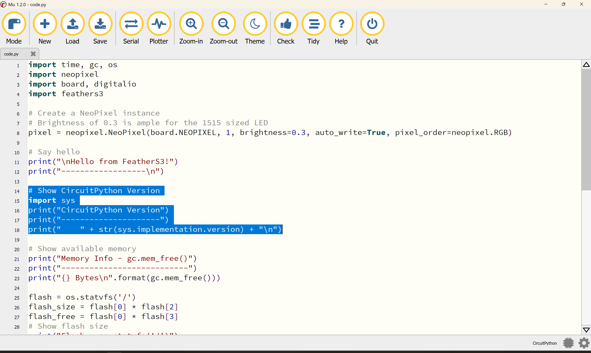
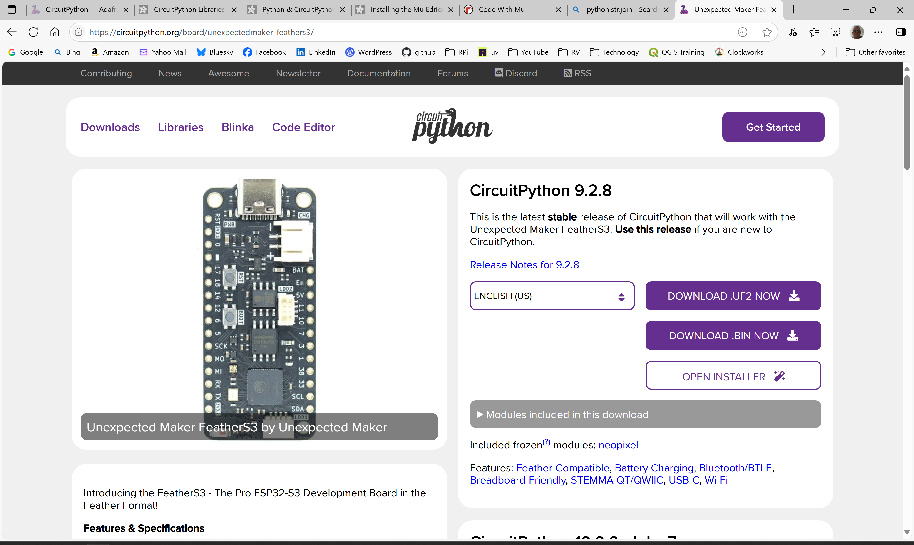

# Telemetry Motion Logging

Logs 9 DOF (degrees of freedom) IMU (inertial motion unit) captured from [ESP32-S3 processor](https://en.wikipedia.org/wiki/ESP32#ESP32-S3) based [CircuitPython](https://circuitpython.org/) enabled feather micro-controller connected to [I2C enabled 9 DOF IMU feather wing](https://www.adafruit.com/product/4754).

## **UNDER CONSTRUCTION**

## Motivation

Integrate motion data with vehicle engine and location data for better, more accurate analytics.

In this application, 9 DOF (degrees of freedom) IMUs (inertial motion units) measure and report vehicle acceleration, angular rate, and compass heading using a combination of sensors like accelerometers and gyroscopes. That is, IMUs are used to report an object's orientation, velocity, and position changes in 3D space.

## Context

Coming soon...

## Context Diagram


## Features

Coming soon...

## Target Hardware

The Raspberry Pi Data Collector and Hotspot hardware is Raspberry Pi 4 or 5 with 4 GB RAM (or more) and with a 32 GB (or more) SD card running Raspberry Pi OS with the latest ```bookworm``` release installed.


## WIFI/USB Enabled Microcontroller/Sensors

If this is your first time working with CircuitPython, read started with [Getting Started](https://esp32s3.com/getting-started.html) to learn how to work with the [Unexpected Maker FeatherS3](https://esp32s3.com/feathers3.html).  You may need to upgrade the CircuitPython software on the [Unexpected Maker FeatherS3](https://esp32s3.com/feathers3.html).  The software for all CircuitPython supported microcontrollers is found at [CircuitPython downloads page](https://circuitpython.org/downloads).  This is where the [latest stable release of CircuitPython that will work with the Unexpected Maker FeatherS3](https://circuitpython.org/board/unexpectedmaker_feathers3/) can be found.

```powershell
PS C:\> D:
PS D:\> dir


    Directory: D:\


Mode                 LastWriteTime         Length Name
----                 -------------         ------ ----
d-----        12/31/1999  11:00 PM                .fseventsd
d-----        12/31/1999  11:00 PM                lib
-a----        12/31/1999  11:00 PM              0 .metadata_never_index
-a----        12/31/1999  11:00 PM              0 .Trashes
-a----        12/31/1999  11:00 PM              0 settings.toml
-a----          7/2/2025   9:31 AM           1560 code.py
-a----        12/31/1999  11:00 PM            122 boot_out.txt
-a----         6/30/2023   5:55 AM           2135 feathers3.py
-a----         6/30/2023   5:55 AM            455 test_results.txt


PS D:\> type boot_out.txt
Adafruit CircuitPython 8.1.0 on 2023-05-22; FeatherS3 with ESP32S3
Board ID:unexpectedmaker_feathers3
UID:CEADB314FBC2
PS D:\>
```

```bash
$ df -h
$ cd /media/<username>/CIRCUITPI
$ ls -l
$ cat boot_out.txt
Adafruit CircuitPython 8.1.0 on 2023-05-22; FeatherS3 with ESP32S3
Board ID:unexpectedmaker_feathers3
UID:CEADB314FBC2
$
```

In order to check the CircuitPython version running on a [Unexpected Maker FeatherS3](https://esp32s3.com/feathers3.html), you will need to create a console session.  One easy way to do that on Windows, Mac, Raspberry Pi and Linux based systems is to install the [Mu Editor](https://learn.adafruit.com/welcome-to-circuitpython/installing-mu-editor).  Follow these steps:

- Plug the [Unexpected Maker FeatherS3](https://esp32s3.com/feathers3.html) into your computer's USB port.
- Launch [Mu](https://codewith.mu/)
- Select **Load** from the top menu bar
- Select the file ```code.py``` from the **Open File** dialog box


- Add additional code above line 14 ```# Show available memory```


```python
# Show CircuitPython Version
import sys
print("CircuitPython Version")
print("---------------------")
print("    " + str(sys.implementation.version) + "\n")
```



- Select **Serial** from the top menu bar


- Select **Save** from the top menu bar

  The **Save** action causes the ```code.py``` code to run with the results showing up in the [**CircuitPython REPL**](https://codewith.mu/en/tutorials/1.2/repl).


- From the above, ```[8, 1, 0]``` means CircuitPython version ```8.1.0```.
- Go to the [[latest stable release of CircuitPython that will work with the Unexpected Maker FeatherS3]](https://circuitpython.org/board/unexpectedmaker_feathers3/) and record the most recent available version



- Compare the two versions and if there is a newer version, upgrade your microcontroller CircuitPython software


[Adafruit 9-DOF Orientation IMU Fusion Breakout - BNO085 - STEMMA QT/Qwiic](https://www.adafruit.com/product/4754) requires software libraries installed on the [Unexpected Maker FeatherS3](https://esp32s3.com/feathers3.html).  Instructions on how best to install the required Adafruit libraries can be found at [CircuitPython Installation of BNO08x Library](https://learn.adafruit.com/adafruit-9-dof-orientation-imu-fusion-breakout-bno085/python-circuitpython#circuitpython-installation-of-bno08x-library-3072328).  To make sure you have each of the required dependencies, read through the [CircuitPython Libraries](https://learn.adafruit.com/welcome-to-circuitpython/circuitpython-libraries).

Be sure to install each of the dependencies onto the [Unexpected Maker FeatherS3](https://esp32s3.com/feathers3.html):

- adafruit_BNO08x
- adafruit_bus_device


The USB interface to the [Unexpected Maker FeatherS3](https://esp32s3.com/feathers3.html), can be used for power only as shown above and below assuming WIFI is the data transport protocol from the microcontroller **or** the microcontroller can be connected directly to the Raspberry Pi Data Collector's USB.  That is, USB can be used for data transport.  However, during initial testing microcontroller/sensor placement in the vehicle was an issue.  The sensor moved around in the vehicle making data analysis more difficult.  After switching to WIFI, the microcontroller/sensor was fixed securely to a painted surface using two-sided tape as shown below.


When mounting the microcontroller and sensor in the vehicle, be sure to orient the sensor flat to the floor of the vehicle (truck bed) with the x axis arrow pointing straight ahead.  Don't worry if it isn't exactly straight.


The image above shows the [I2C enabled 9 DOF IMU feather wing](https://www.adafruit.com/product/4754) with the orientation bit copied to the side to make it easier to find.  ```x``` should be forward making positive ```y``` to the left and positive ```z``` up.

## Microcontroller Application Software


## Usage

```bash
$ uv run -m imu_logger.imu_logger --help
usage: imu_logger.py [-h] [--usb] [--serial_device_name SERIAL_DEVICE_NAME] [--no_wifi] [--upp_port_number UPP_PORT_NUMBER] [--verbose] [--version]
                     [base_path]

Telemetry IMU Logger

positional arguments:
  base_path             Relative or absolute output data directory. Defaults to '/home/lbp/telemetry-data/data'.

options:
  -h, --help            show this help message and exit
  --usb                 CircuitPython microcontroller connects via USB is True. Default is False.
  --serial_device_name SERIAL_DEVICE_NAME
                        Name for the hardware IMU serial device. Defaults to None
  --no_wifi             CircuitPython microcontroller does NOT use WIFI to connect. Default is False
  --udp_port_number UPP_PORT_NUMBER
                        TCP/IP UDP port number for receiving datagrams. Defaults to '50224'
  --verbose             Turn DEBUG logging on. Default is off.
  --version             Print version number and exit.
$
```

## Sample Log Data

```json
{
  "command_name": "acceleration",
  "obd_response_value": {
    "record_number": 493,
    "x": -0.160156,
    "y": -0.246094,
    "z": 9.74609
  },
  "iso_ts_pre": "2025-05-17T17:23:09.996770+00:00",
  "iso_ts_post": "2025-05-17T17:23:10.825158+00:00"
}
{
  "command_name": "gravity", 
  "obd_response_value": {
    "record_number": 493,
    "x": -0.148438,
    "y": -0.28125,
    "z": 9.72656
  },
  "iso_ts_pre": "2025-05-17T17:23:10.829531+00:00",
  "iso_ts_post": "2025-05-17T17:23:10.829674+00:00"
}
{
  "command_name": "gyroscope",
  "obd_response_value": {
    "record_number": 493,
    "x": 0.00390625,
    "y": 0.0,
    "z": -0.00195313
  },
  "iso_ts_pre": "2025-05-17T17:23:10.834484+00:00",
  "iso_ts_post": "2025-05-17T17:23:10.866375+00:00"
}
{
  "command_name": "linear_acceleration",
  "obd_response_value": {
    "record_number": 493,
    "x": 0.0273438,
    "y": 0.0273438,
    "z": -0.0234375
  },
  "iso_ts_pre": "2025-05-17T17:23:10.871766+00:00",
  "iso_ts_post": "2025-05-17T17:23:10.871887+00:00"
}
{
  "command_name": "magnetometer",
  "obd_response_value": {
    "record_number": 493,
    "x": 94.5625,
    "y": -28.8125,
    "z": 50.3125
  },
  "iso_ts_pre": "2025-05-17T17:23:10.878966+00:00",
  "iso_ts_post": "2025-05-17T17:23:10.892621+00:00"
}
{
  "command_name": "rotation_vector",
  "obd_response_value": {
    "record_number": 493,
    "vector": [-0.0150146, -0.00549316, 0.738342, 0.674255],
    "roll": 1.661261158154104,
    "pitch": 0.014764774838934513,
    "yaw": -3.1132274490200587
  },
  "iso_ts_pre": "2025-05-17T17:23:10.896280+00:00",
  "iso_ts_post": "2025-05-17T17:23:10.918634+00:00"
}
```

## Log Data Description

## Raspberry Pi System and Installation

[Step 1 - Raspberry Pi System Software Installation](./README-rpdc.md#step-1---raspberry-pi-system-software-installation) must be completed before continuing.

The default data connection type between the Raspberry Pi and the CircuitPython microcontroller is WIFI.  Currently two modules are supported using WIFI enabled CircuitPython microcontrollers  - this solution (```motion```) and the [trailer module](./README-trailer.md).  Each must use the same WIFI access point and the same target IP address for the Raspberry Pi Data Collection system.  However, each module has its own target UDP port number the default values for each are different.

As part of preparing the Raspberry Pi Data Collection system to support this module, it must be configured to be a WIFI access point.

Configuring a WIFI Access Point on a Raspberry Pi 4 or 5 running ```Debian 12 bookworm``` is tricky because, in this latest release of Raspberry Pi, network configuration has been dramatically changed to a new configuration subsystem called [Network Manager](https://networkmanager.dev/).   More rough spots need to be smoothed out. **Beware - WIFI access point creation instructions found on the Internet often refer to the old way of configuring networks or worse.  Old and new ways of configuring are mixed together.**

Follow the instruction found in [Configuring Raspberry Pi WIFI/Hotspot/Router](docs/wifi-hotspot-router.md).  Once you have a hotspot up and running on your Raspberry Pi, the CircuitPython microcontroller may need to be reconfigured/configured to work with the Raspberry Pi Data Collection system in-vehicle hotspot.  Follow the instructions provided by [WeatherFlow](https://tempest.earth/).

### Selecting USB Connection

In ```telemetry-imu/bin``` there are two versions of the startup script.  The default startup script, ```imu_logger.sh``` should be used for the default behavior which is WIFI.  When using USB as the connection method, use ```imu_logger-USB.sh``` instead.

### Problems Identifying USB Serial Device Name

Telemetry IMU includes ```imu_logger.usb_devices```, a Python program that will tell you if it can find the correct device name.

With the IMU (_Unexpected Maker FeatherS3_) unplugged from the host USB port, running ```imu_logger.usb_devices``` shows the GPS receiver which is plugged into a USB port.

```bash
lbp@telemetry2:~ $ python3.11 -m imu_logger.usb_devices
Candidate Serial Device List (non-USB devices excluded)

	+1 /dev/ttyACM0
		Name: ttyACM0
		USB VID: 5446
		USB PID: 424
		Description: u-blox GNSS receiver
		Hardware ID: USB VID:PID=1546:01A8 LOCATION=1-1.2:1.0
		Manufacturer: u-blox AG - www.u-blox.com
		Product: u-blox GNSS receiver
		Serial Number: None
		Location: 1-1.2:1.0
		interface: None

Found 1 USB Serial Device(s)

Device <Unexpected Maker FeatherS3> not found.
lbp@telemetry2:~ $ 
```

Using a different MicroPython micro-controller (other than an _Unexpected Maker FeatherS3_) will require changing the following code snippet to match your MicroPython micro-controller.  Running the above will provide you with the correct values for ```DEFAULT_USB_VID``` and ```DEFAULT_USB_PID```.

```python
# The following are specific to the Unexpected Maker FeatherS3
DEFAULT_USB_VID = 12346
DEFAULT_USB_PID = 32983
CIRCUITPYTHON_DEVICE_NAME = "Unexpected Maker FeatherS3"
```

## Unexpected Maker Feather S3 CircuitPython Installation

## LICENSE

[MIT License](./LICENSE.md)
