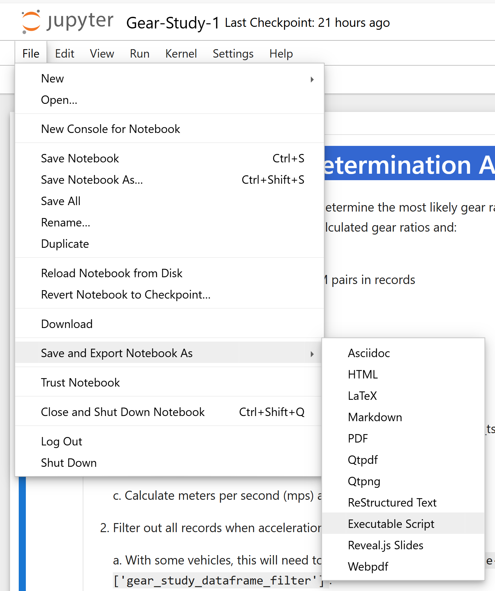

# Vehicle Telemetry System Analysis

Code, Jupyter Notebooks and Marimo Notebooks supporting analysis of data generated by related modules:

- [Engine](./README-engine.md)
- [Location](./README-location.md)
- [Weather](./README-weather.md)
- [Motion](./README-motion.md)
- [Trailer](./README-trailer.md)
- [Aggregation](./README-aggregation.md)

## **UNDER CONSTRUCTION**

## Launching Jupyter Notebooks

Complete the [Python Project Software Installation](./README.md/#python-project-software-build-and-installation) before continuing.

Start from the repository's directory.

```bash
cd vehicle-telemetry-system
```

Next, activate the Python virtual environment.

On Windows this looks like:

```bash
.\.venv\Scripts\activate
```

On Linux, Raspberry Pi OS or Mac:

```bash
source .venv/Scripts/activate
```

Launch the Jupyter Notebook from the repository directory.

```bash
uv run jupyter notebook
```

## Jupyter Notebooks

Using the Jupyter web user interface, go to the ```notebooks``` directory in the repository.  If this is the first time launching a particular Jupyter notebook (extension ```.ipynb```), find the corresponding Python source file (extension ```.py```) in the same directory and launch that.  Changes made to the notebook will be automatically pushed into the Python source file when notebooks are saved.

In this repository, notebooks, encoded as **[jupytext](https://jupytext.readthedocs.io/en/latest/) [```py:percent``` format](https://jupytext.readthedocs.io/en/latest/formats-scripts.html)** files, are found in the ```notebooks/``` directory and support ```git``` based source code control.  ```py:percent``` or **jupytext** format files use the ```.py``` suffix like regular Python programs.  The ```py:percent``` encoding is in structured comments so that developer tools such as Visual Studio Code can easily edit  ```py:percent``` format files.

Recreating ```.ipynb``` notebook files can be done in a Jupyter Notebook by opening a  ```py:percent``` format file and saving it.  In fact, Jupyter will automatically synchronize any changes in ```.ipynb``` notebooks to ```py:percent``` format files automatically.

IDE's such as [Visual Studio Code](https://marketplace.visualstudio.com/items?itemName=congyiwu.vscode-jupytext) support Jupytext extensions/plugins.

The command line tool ```nbconvert``` is capable of converting ```*.ipynb``` notebooks into a variety of different formats including **jupytext**.  Look for [Executable script](https://nbconvert.readthedocs.io/en/latest/usage.html#convert-script) in the [```nbconvert``` documentation](https://nbconvert.readthedocs.io/en/latest/)

To save ```*.ipynb``` Jupyter notebooks as **jupytext** ```*.py``` notebooks:

```bash
cd vehicle-telemetry-system
source .venv\Scripts\activate
cd notebooks
uv run python -m nbconvert --to script <notebook-name>.ipynb
```

For example, to convert ```vehicle-telemetry-systgem/notebooks/Gear-Study-1.ipynb``` to ```vehicle-telemetry-systgem/notebooks/Gear-Study-1.py```:

```bash
(vehicle-telemetry-system) vehicle-telemetry-system/notebooks $ uv run python -m nbconvert --to script Gear-Study-1.ipynb
[NbConvertApp] Converting notebook Gear-Study-1.ipynb to script
[NbConvertApp] Writing 9294 bytes to Gear-Study-1.py
(vehicle-telemetry-system) vehicle-telemetry-system/notebooks> $
```

Saving ```*.ipynb``` Jupyter notebooks as **jupytext** ```*.py``` notebooks can be done in notebook development/runtime environment (browser) as well.:




## Marimo Notebooks

There are some advantages to using the Marimo notebook system over Jupyter Notebooks.  **Under Construction** I've placed a single example in the repository under the ```marimo-notebooks``` directory.  The notebook failed to work the last time I tried it.  It may be a while before I get back into it to see what I screwed up.

To run the failing Marimo notebook:

```bash
uv run marimo marimo-notebooks/Gear-Study-1.py
```

To edit/create Marimo notebooks:

```bash
uv run marimo edit
```

## Gear Study

I had this crazy idea that I could get better gas mileage if I managed the shifting instead of letting the engine and automatic transmission decide when to shift.  This notion was especially strong while driving through hilly terrain.  Notably on Interstate 44 through Missouri and Interstate 10 between San Antonio and Fort Stockton Texas.

Then I thought that better controlling the shift points would also be beneficial when vehicles were loaded, experiencing adverse weather (headwinds) or running at high elevation.

Even though the OBD standard, [J1979-DA, Digital Annex of E/E Diagnostic Test Modes J1979DA_202104](https://www.sae.org/standards/content/j1979da_202104/), documents an OBD command to retrieve the current gear from the vehicle, none of the vehicles tested support this particular command.  Also, vehicle manufacturers don't always document the different transmission gear ratios in the cars they sell.  It is difficult to determine how a vehicle actually works (or doesn't work).

Determining the current transmission gear in real time is the *Gear Study*'s goal.

I still don't know if it is hubris to think a better method, one that improves fuel efficiency, for making shifting decisions can be built.  But I *do* know a way to figure out what gear the vehicle is in.

- ```Gear-Study-0``` - Per Vehicle OBD Log Evaluation Reports
- ```Gear-Study-1``` - Gear Determination And Error Estimation
- ```Gear-Study-2``` - summary
- ```Gear-Study-3``` - summary

## Fuel Study

## Supporting Code

## Private Data

## LICENSE

[MIT License](./LICENSE.md)
