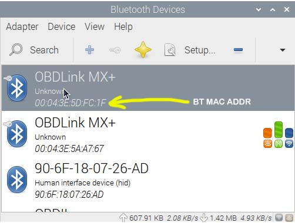
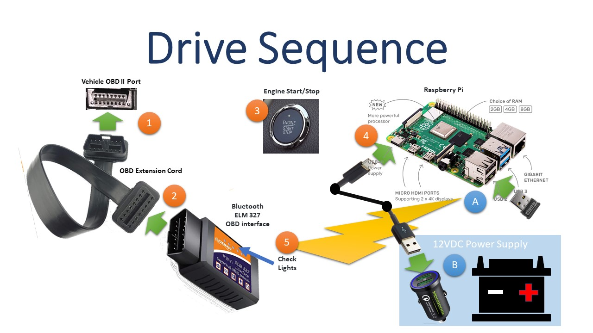
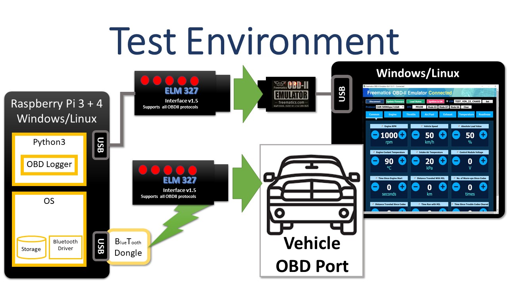

# Raspberry Pi Data Collector

How to prepare a Raspberry Pi system for in vehicle use as a headless data collection system.

## **Under Construction**

The following repositories have been used to create this documentation:

- **Vehicle Sensor Modules**
  - [engine](https://github.com/thatlarrypearson/telemetry-obd) (OBD)
  - [location](https://github.com/thatlarrypearson/telemetry-gps) (GPS)
  - [motion](https://github.com/thatlarrypearson/telemetry-imu) (IMU)
  - [weather](https://github.com/thatlarrypearson/telemetry-wthr) (WTHR)
  - [trailer](https://github.com/thatlarrypearson/telemetry-trailer-connector) (TRLR)
- **Common Functions**
  - [Common utilities](https://github.com/thatlarrypearson/telemetry-utility) (UTILITY)
  - [Audit Capabilities](https://github.com/thatlarrypearson/telemetry-counter) (COUNTER)
- **Data Management Analysis**
  - [Combine JSON records into CSV records](https://github.com/thatlarrypearson/telemetry-obd-log-to-csv) (JSON2CSV)
  - [Notebook Data Analysis](https://github.com/thatlarrypearson/telemetry-analysis) (ANALYSIS)

Moving forward, how to prepare a Raspberry Pi system for use as a headless data collection system will be in this document.  Further development of documentation and functional capabilities in the original repositories has stopped.

## Step 1 - Raspberry Pi System Software Installation

The recommended Raspberry Pi system is a [Raspberry Pi 4 or 5 Model B](https://www.raspberrypi.com/products/raspberry-pi-4-model-b/), [Raspberry Pi 400 or 500](https://www.raspberrypi.com/products/raspberry-pi-400/) or Raspberry Pi 5 with 4 GB RAM or more.  The full 64 bit release of [Raspberry Pi OS](https://www.raspberrypi.com/software/) version 12 (bookworm) or newer, including the GUI is the recommended operating system.  When choosing a [Micro-SD card](https://en.wikipedia.org/wiki/SD_card) for storage, look for Internet resources like [Best microSD Cards for Raspberry Pi & SBCs](https://bret.dk/best-raspberry-pi-micro-sd-cards/) as a guide to making an appropriate selection.  Select cards 32 GB or larger.  I've been using 128 GB cards.

After installing Raspberry Pi OS on the Raspberry Pi computer,  update the operating system to the newest version.  One way to do this is as follows:

```bash
# update and upgrade Linux/Raspberry Pi OS
sudo apt update
sudo apt upgrade -y
sudo apt autoremove -y
sudo shutdown -r now
```

After the system reboots, do a distribution upgrade to ensure that you are truly running the latest version.

```bash
sudo apt dist-upgrade -y
sudo shutdown -r now
```

If a distribution upgrade occurred, then remove all the unnecessary software from the previous release.

```bash
sudo apt autoremove -y
```

## Step 2 - Install Bluetooth Software

Follow the instructions in the [Install System Software](./README-bluetooth.md/#install-system-software) section of the [Bluetooth Installation and Configuration](./README-bluetooth.md) document.

## Step 3 - Pair Bluetooth Devices

Bluetooth OBD adapters need to be paired.  Follow the instructions starting with [Pairing Bluetooth OBD Devices](./README-bluetooth.md/#pairing-bluetooth-obd-devices).

After completing the OBD adapter pairing, make a note of the Bluetooth Media Access Control layer addresses (e.g. something like ```"00:04:3E:5A:A7:67"```).  It will need to be set in the startup bash scripts.  This address, like an Internet address, must match your runtime configuration.  Assuming your Bluetooth OBD adapter is currently paired to your Raspberry Pi, click on the Bluetooth icon on your Raspberry Pi desktop and select the ```Devices``` option.



The yellow arrow points to where the Bluetooth MAC address is found on the ```Devices``` dialog box.  Make a note of the Bluetooth MAC address.  This will be needed in a configuration step below.

## Step 4 - Install Optional Software

Install an IDE (Integrated Development Environment).

```bash
# Microsoft Visual Studio Code or other IDE (Integrated Development Environment)
sudo apt install -y code
```

If you choose ```code```, then use the Raspberry Pi GUI to launch ```code``` from the ```menu->Programming Tools->code``` to add Python and bash shell support.

Are there other tools you like to have on your Linux based computers?  Install them now.

## Step 5 - Build and Install Python Software

To build and install Python software you will:

- install Python
- create and manage the virtual Python runtime environment
- create a Python package and install it into the virtual environment
- run specific Python modules installed in the virtual environment

Follow the instructions found at [Python Project Software Build and Installation](./README.md/#python-project-software-build-and-installation).

## Step 6 - Run Simple Tests

Run some simple tests to [validate the package build and installation](./README.md/#simple-tests-validating-build-and-installation).

## Step 7 - Raspberry Pi Headless Operation - Modify ```/etc/rc.local```

In order to reliably run in an automotive environment, sensor modules need to start automatically after all preconditions are satisfied.  That is, the application must start without any user interaction.  The trigger for starting the Vehicle Telemetry System is powering up the Raspberry Pi Data Collector computer.

On the Raspberry Pi, commands embedded in "```/etc/rc.local```" will be run at the end of the system startup sequence by the ```root``` user.  Make your Raspberry Pi Data Collector's ```/etc/rc.local``` look like ```vehicle-telemetry-system/etc/rc.local``` provided in this repository.

A copy of the ```vehicle-telemetry-system/etc/rc.local``` file follows.  The part to add into the ```/etc/rc.local``` file is the part between the lines with ```# BEGIN VEHICLE-TELEMETRY-SYSTEM SUPPORT``` and ```# END VEHICLE-TELEMETRY-SYSTEM SUPPORT```.

```bash
#!/bin/sh -e
#
# rc.local
#
# This script is executed at the end of each multiuser runlevel.
# Make sure that the script will "exit 0" on success or any other
# value on error.
#
# In order to enable or disable this script just change the execution
# bits.
#
# By default this script does nothing.

# Print the IP address
_IP=$(hostname -I) || true
if [ "$_IP" ]; then
  printf "My IP address is %s\n" "$_IP"
fi

# BEGIN VEHICLE-TELEMETRY-SYSTEM SUPPORT

# This must be started 1st
if [ -x "/root/bin/vts.rc.local.audit" ]
then
  # This must run to completion before continuing this script.
  /bin/nohup "/root/bin/vts.rc.local.audit"
fi

# This must be started 2nd
if [ -x "/root/bin/vts.rc.local.WittyPi4" ]
then
  # This must run to completion before continuing this script.
  /bin/nohup "/root/bin/vts.rc.local.WittyPi4"
fi

# This must be started 3rd
if [ -x "/root/bin/vts.rc.local.utility" ]
then
  /bin/nohup "/root/bin/vts.rc.local.utility" &
fi

if [ -x "/root/bin/vts.rc.local.location" ]
then
  /bin/nohup "/root/bin/vts.rc.local.location" &
fi

if [ -x "/root/bin/vts.rc.local.motion" ]
then
  /bin/nohup "/root/bin/vts.rc.local.motion" &
fi

if [ -x "/root/bin/vts.rc.local.weather" ]
then
  /bin/nohup "/root/bin/vts.rc.local.weather" &
fi

if [ -x "/root/bin/vts.rc.local.trailer" ]
then
  /bin/nohup "/root/bin/vts.rc.local.trailer" &
fi

if [ -x "/root/bin/vts.rc.local.engine" ]
then
  /bin/nohup "/root/bin/vts.rc.local.engine" &
fi

# END VEHICLE-TELEMETRY-SYSTEM SUPPORT

exit 0
```

```/etc/rc.local``` invokes ```/root/bin/telemetry.rc.<module-name>```.  The functionality in ```/root/bin/telemetry.rc.local.<module-name``` is not placed in ```/etc/rc.local``` for these reasons:

- Rasberry Pi OS (```Bullseye```) invokes /etc/rc.local with ```/bin/sh``` (soft link to ```/bin/dash```) which is not the same as ```/usr/bin/bash```, the required shell.
- ```/bin/sh``` is invoked with ```-e``` flag meaning that ```/etc/rc.local``` will stop execution when a pipe fails.  See [bash documentation](https://www.gnu.org/software/bash/manual/bash.pdf).
- The command ```bluetoothctl```, required to automatically detect and connect to the correct Bluetooth device, generates a pipe failure fault when run in ```/etc/rc.local```.  It will run fine as ```root``` in the terminal.
- Modules (e.g. ```vehicle-telemetry-system/root/bin/telemetry.rc.local.<module-name>```) must be started as root.  In some cases this is required to initialize and configure Raspberry Pi OS subsystems (e.g. Bluetooth and the time clock) in addition to setting the username and group of the user executing the Python software.

AFter any required OS subsystems are initialized/configured, then root invokes the module specific start script  ```vehicle-telemetry-system/bin/<module-script>.sh``` which then invokes the corresponding Python program.

Shell variables, like ```VTS_USER``` used by module startups scripts (e.g. ```vehicle-telemetry-system/root/bin/vts.rc.local.<module-name>```) are set in ```vehicle-telemetry-system/root/bin/vts.root.profile``` to match the Raspberry Pi Data Collector system being built.  Some of these environment variables may be overridden in individual startup scripts.  See ```vehicle-telemetry-system/root/bin/vts.rc.local.WittyPi4```'s ```export VTS_GROUP='i2c'``` for an example.

The ```runuser``` command in "```vehicle-telemetry-system/root/bin/telemetry.rc.local.<module-name>```" file runs the "```vehicle-telemetry-system/bin/<module-name>.sh```" ```bash``` shell program as user "```human```" and group "```dialout```".

## Step 8 - Raspberry Pi Headless Operation - Modify ```vehicle-telemetry-system/root/bin/vts.root.profile```

Modify these shell variable values in ```vehicle-telemetry-system/root/bin/vts.root.profile```:

- VTS_USER
  This variable must be set to the username you plan to use to run this software.  Before a username can be used, it must be a valid username in the Raspberry Pi Data Collector system.

- VTS_BT_MAC_ADDRESS
  This variable must be set to match the Bluetooth OBD adapter's MAC (media access control) address from [Step 3 - Pair Bluetooth Devices](#step-3---pair-bluetooth-devices).

Other shell variables in the file can be modified to suit your needs.

Once the ```vehicle-telemetry-system/root/bin/vts.root.profile``` file has been modified, it and the other files must be copied to ```/root/bin``` and the file permissions changed.

```bash
$ cd
$ cd vehicle-telemetry-system/root/bin
$ sudo mkdir /root/bin
$ sudo cp  vts.* /root/bin
$ sudo chmod 0755 /root/bin/vts.*
$ sudo ls -l /root/bin
$ ls -l
-rwxr-xr-x 1 human human  747 May 12 15:53 vts.rc.local.WittyPi4*
-rwxr-xr-x 1 human human  329 May 12 15:57 vts.rc.local.audit*
-rwxr-xr-x 1 human human 2153 May 12 15:48 vts.rc.local.engine*
-rwxr-xr-x 1 human human  796 May 12 13:56 vts.rc.local.location*
-rwxr-xr-x 1 human human  680 May 12 13:57 vts.rc.local.motion*
-rwxr-xr-x 1 human human  693 May 12 13:57 vts.rc.local.trailer*
-rwxr-xr-x 1 human human  854 May 12 13:57 vts.rc.local.utility*
-rwxr-xr-x 1 human human  680 May 12 13:58 vts.rc.local.weather*
-rwxr-xr-x 1 human human  657 May 13 13:23 vts.root.profile*
$
```

## Step 9 - Raspberry Pi Headless Operation - Modify ```vehicle-telemetry-system/bin/vts.user.profile```

Edit, if necessary, the ```vehicle-telemetry-system/bin/vts.user.profile``` file.

Make all of the module VTS_USER launcher files executable
by using the command ```chmod +x obd_logger.sh obd_tester.sh```.

## Date/Time Accuracy During Data Collection

After the power has been off, an unmodified Raspberry Pi will do one of the following to determine the time it starts up with:

- starts up with the time value stored on disk
- goes out to the Internet to a Network Time Protocol (NTP) server to get the current time

While the Raspberry Pi runs, time updates as expected in its built-in clock and it periodically saves the current time value to disk.  Because the built-in clock only works while the power is on, when the power goes off, the clock stops working.  When power comes back on, the clock starts up from zero time.  During the boot process, the clock gets updated from the disk and later, after the network starts up, an NTP server.  No network, no time update.

Each bit of data collected is collected with timestamps.  Data and log file names have embedded timestamps in them.  When the clock is hours or even weeks behind the actual time, data analysis becomes more difficult as it is hard to connect OBD data with driver activity such as stops for fuel or stops at destinations.

One solution to consider is to always provide the Raspberry Pi with Internet access, especially during the boot process.  For example, mobile phones (with the correct carrier plan) support mobile WIFI hotspot capability.  In iPhone settings, this shows up in the **Settings** app as **Personal Hotspot**.

On an iPhone, the **Personal Hotspot** times out and goes to sleep when no devices are connected to it.  Before starting the vehicle, disable the hotspot and reenable it through the iPhone **Settings** app.  This approach worked flawlessly on a two day, 1,000 mile trip with seven fuel stops, one overnight stop and several random health stops.

Running Raspberry Pi's in headless mode requires WIFI to be configured in advance.  For example, put each phone or tablet into mobile hotspot mode and then configure the Raspberry Pi to automatically connect to them before using the logging system in a vehicle.

A possible solution is to use add a GPS receiver to the Raspberry Pi to add [Stratum-1 NTP Server](https://www.satsignal.eu/ntp/Raspberry-Pi-NTP.html) capability to the Raspberry Pi.  This works in remote environments were mobile wireless signals are unavailable.  It also requires less work on behalf of the vehicle operator.

The solution currently in use a Raspberry Pi UPS HAT with a built-in real-time clock.  This option, using the [Raspberry Pi UPS HAT](https://www.pishop.us/product/raspberry-pi-ups-hat/) had been working well with no operator intervention required.  However, once the Lithium battery got funky, the built-in real-time clock often lost power.  Power loss resets the clock to 1970 almost every time the system boots.

In environments where the following are unavailable:

- battery backed real-time clock
- Internet access
- GPS coupled with local Stratum-1 NTP Server

The function ```get_output_file_name()``` from [Telemetry System Boot and Application Startup Counter](https://github.com/thatlarrypearson/telemetry-counter) has been added to ```obd_logger``` and ```obd_tester``` to ensure the creation of data files with unique invariant identifiers.  These file names assure that data files can be processed in the order they were created.  For the file naming to work properly, ```obd_logger``` and ```obd_tester``` need to be started through the bash startup programs found in ```telemetry-obd/bin/```  named ```obd_logger.sh``` and ```obd_tester.sh```.

Data timestamp information may still need downstream processing using embedded GPS data to recalibrate system timestamp data.  Examples for this type of downstream processing can be found in the ```obd_log_to_csv``` package.  See [Telemetry OBD Data To CSV File](https://github.com/thatlarrypearson/telemetry-obd-log-to-csv).

## Running Raspberry Pi In Vehicle

Getting the Raspberry Pi and OBD interface to work reliably in running vehicles turned out to be problematic.  The initial setup used a USB OBD interface.  The thinking was that a hard wired USB connection between the Raspberry Pi and the ODB interface would be simpler and more reliable.  On the 2013 Jeep Wrangler Rubicon, this was true.  The 110 VAC power adapter was plugged into the Jeep's 110 VAC outlet.

However, both the 2017 Ford F-450 Truck and 2019 Ford EcoSport SUV wouldn't power the Raspberry Pi if it was connected via USB to an OBD interface.  It didn't matter if the Pi was plugged into 12 VDC or 110 VAC  outlets.  It wasn't until a 600 Watt Sine Wave Inverter was used to power the Raspberry Pi that the underlying problem became clear.  The inverter has [GFCI](https://www.bobvila.com/articles/gfci-outlets/) circuitry that tripped soon after the Raspberry Pi started communicating through USB to the OBD interface.  There wasn't adequate electrical isolation between the vehicle OBD port and the Raspberry Pi.

Given that electrical isolation was an issue, it became clear that wireless connection between components would be necessary.  This is why Bluetooth became the preferred solution.

Depending on the power supply powering the Raspberry Pi, there may also be issues with power when powering the Pi directly through the vehicle.  Switching to a portable 12 VDC battery also made the solution more stable.

## Driver Responsibilities



Before turning on the ignition:

- turn on vehicle ignition and start the vehicle
- (optional) enable mobile hotspot

After vehicle is running:

- plug OBD adapter into vehicle OBD port
- connect Bluetooth enabled Raspberry Pi to power
- Bluetooth ELM 327 OBD interface lights start flashing within four minutes otherwise failure

After turning off the vehicle:

- disconnect power from Raspberry Pi
- unplug the OBD adapter
- (optional) disable mobile hotspot

## Software Testing

Software was tested manually using a [Freematics OBD-II Emulator](https://freematics.com/products/freematics-obd-emulator-mk2/) (vehicle emulator) as well as in actual vehicles.  The test environment is as follows:



The Freematics OBD-II Emulator does not cover all available OBD commands.  This is especially true for the additional commands provided through ```telemetry_obd.add_commands.py```.  Be aware that actual vehicle responses may not match the software.  Also be aware that test code coverage in ```telemetry_obd.add_commands.py``` is sketchy at best.  Your mileage may vary.

## Manufacturer Warranty Information

The 2019 Ford EcoSport manual and other vehicles have the following statement or something similar with respect to aftermarket OBD devices:

- "Your vehicle has an OBD Data Link Connector (DLC) that is used in conjunction with a diagnostic scan tool for vehicle diagnostics, repairs and reprogramming services. Installing an aftermarket device that uses the DLC during normal driving for purposes such as remote insurance company monitoring, transmission of vehicle data to other devices or entities, or altering the performance of the vehicle, may cause interference with or even damage to vehicle systems. We do not recommend or endorse the use of aftermarket plug-in devices unless approved by Ford. The vehicle Warranty will not cover damage caused by an aftermarket plug-in device."

You use this software at your own risk.

## LICENSE

[MIT License](./LICENSE.md)


- [Raspberry Pi Data Collector](./README-rpdc.md)

