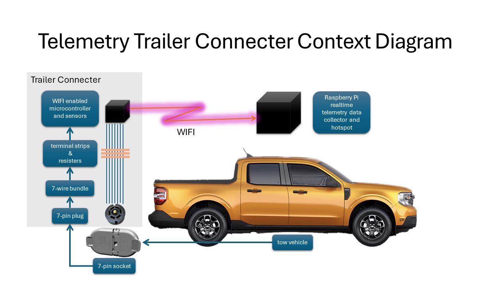
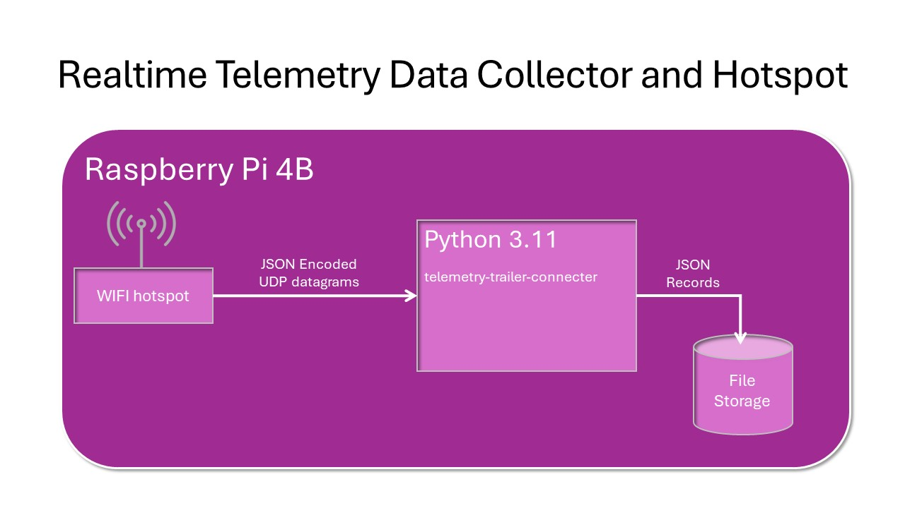
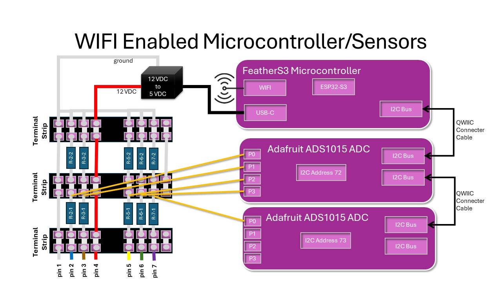
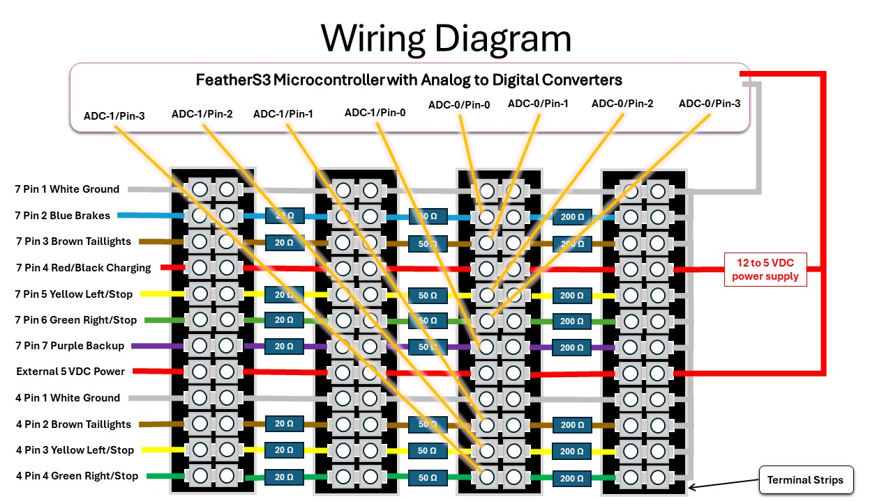

# Telemetry Trailer Connector Logger

Collect and log data from 7 and 4-way trailer connectors.

On tow vehicles, 7-Way Trailer Connectors are used to determine brakes (on/off), brake controller output (brake pressure), lights (on/off) and reverse (engaged/not engaged).  The wiring and applications also support 4-Way Trailer Connectors.  The 4-Way Connectors can only provide taillights, right/left blinkers and brake light signals.

## **UNDER CONSTRUCTION**

## Context Diagram

### Telemetry Trailer Connecter Context Diagram



### Realtime Telemetry Data Collector and Hotspot

#### Target System

The software is being tested on a Raspberry Pi 4 (or 5) running Raspberry Pi OS ```bookworm```.  More information about the target system can be found at [Raspberry Pi Data Collector](./README-rpdc.md)

#### Target Hardware

Raspberry Pi 4 or 5 with 4 GB RAM (or more) and with a 32 GB (or more) SD card.



### WIFI Enabled Microcontroller/Sensors

See [CircuitPython Microcontrollers](./CircuitPythonMicrocontrollers.md) for more information about microcontroller and sensors.



### Wiring Diagram



## Motivation

Integrate brake use information with vehicle engine, motion, wind and location data for better, more accurate analytics.

At any speed, brake use slows vehicle motion and is material in fuel usage.

## Features

* When using 7 pin trailer connectors the following are logged:
  * brake activation and brake pressure
  * headlights/running lights
  * turn signals
* When using 4 pin trailer connectors the following are logged:
  * brake activation
  * turn signals
  * headlights/running lights

## Microcontroller Hardware

The [Unexpected Maker FeatherS3](https://unexpectedmaker.com/shop.html#!/FeatherS3/p/577111310/category=0) features:

* ESP32-S3 Chip
* Supports WIFI and Bluetooth
* Supports I2C Bus with QWIIC/STEMMA QT Connectors
* Well Supported with Examples and Documentation
* Inexpensive

See [CircuitPython Microcontrollers](./CircuitPythonMicrocontrollers.md#circuitpython-microcontrollers) for installation and configuration information.

## Sensor Hardware

[Adafruit ADS1015 Analog to Digital Converter (ADC) Breakout Board](https://www.adafruit.com/product/1083) features:

* 4 ADC channels
* Supports I2C Bus with QWIIC/STEMMA QT Connectors
* Supports Chaining I2C Bus and Using Up to 4 ADC Breakout Boards (16 Total Channels)
* Well Supported with Examples and Documentation
* Inexpensive

See [CircuitPython Microcontrollers](./CircuitPythonMicrocontrollers.md#circuitpython-microcontrollers) for installation and configuration information.

### Development System Installation

Development systems must be full blown computers running Windows, Mac, Linux or Raspberry Pi OS.

To install a development system on a desktop computer, follow [Python Project Software Build and Installation](./README.md#python-project-software-build-and-installation).

### Raspberry Pi Deployment System Installation

Follow the instructions at [Raspberry Pi Data Collector](./README-rpdc.md) when installing a deployment system.  Pay particular attention to [Step 4 - Configure WIFI Hotspot](./README-rpdc.md/#step-4---configure-wifi-hotspot) since this module requires the use of an in-vehicle hotspot.

## Data Logger Usage

To get the command line flags from the application:

```bash
$ python -m trlr_logger.trlr_logger --help
usage: trlr_logger.py [-h] [--udp_port_number UDP_PORT_NUMBER] [--log_file_directory LOG_FILE_DIRECTORY]
                      [--verbose] [--version]
                      [base_path]

Telemetry Trailer Connector UDP Logger

positional arguments:
  base_path             Relative or absolute output data directory. Defaults to '~/~telemetry-data/data'.

options:
  -h, --help            show this help message and exit
  --udp_port_number UDP_PORT_NUMBER
                        TCP/IP UDP port number for receiving datagrams. Defaults to '50223'
  --log_file_directory LOG_FILE_DIRECTORY
                        Place log files into this directory - defaults to ~/telemetry-data/data
  --verbose             Turn DEBUG logging on. Default is off.
  --version             Print version number and exit.
$ 
```

The default ```UDP_PORT_NUMBER``` is coded into the Raspberry Pi Python application and also into the FeatherS3 Circuit Python application configuration.  See the section on [FeatherS3 Circuit Python Application Configuration](#feathers3-circuit-python-application-configuration)

## Data File Format

The data file format is in the same data file format as is found in the [telemetry-obd](https://github.com/thatlarrypearson/telemetry-obd) application.

Output data files are in a hybrid format.  Data files contain records separated by line feeds (```LF```) or carriage return and line feeds (```CF``` and ```LF```).  The records themselves are formatted in JSON.  Sample output follows:

```python
{
    "command_name": "tc47pin",
    "obd_response_value": {
            "sequence_number": 6804,
            "gain0": 1,
            "gain1": 1,
            "blue_brakes_7": 0.606018,
            "brown_taillights_7": 0.606018,
            "yellow_left_stop_7": 0.610018,
            "green_right_stop_7": 0.604018,
            "purple_backup_7":  0.604018,
            "brown_taillights_4": 0.604018,
            "yellow_left_stop_4":  0.604018,
            "green_right_stop_4":  0.604018,
        },
    "iso_ts_pre": "2024-09-19T14:51:18.503813+00:00",
    "iso_ts_post": "2024-09-19T14:51:19.323545+00:00"
}<CR>
```

## JSON Fields

- ```command_name```
  Specific to the [Telemetry Trailer Connector](https://github.com/thatlarrypearson/telemetry-trailer-connector) application.  The value should always be ```tc47pin```.

- ```obd_response_value```
  OBD response values returned by the Analog to Digital Converters (ADC) in a dictionary as shown above.

  ```sequence_number``` is a count of the number of records sent by the FeatherS3 since the FeatherS3 booted.

  ```gain0``` and ```gain1``` is the voltage gain setting in each ADC.  A value of 1 (default) represents a range of 4.096 Volts.  Resisters (see the Wiring Diagram) drop the vehicle's voltage from 12 VDC seen to the 4.096 range to put the voltage into the right range for ADCs.
  
  7 pin connector ```blue_brakes_7```, ```brown_taillights_7```, ```yellow_left_stop_7```, ```green_right_stop_7```, ```purple_backup_7```

  4 pin connector ```brown_taillights_4```, ```yellow_left_stop_4```, ```green_right_stop_4```

  With this application, the returned values represent scaled voltages for each signal presented by the vehicle's trailer hitch connector.  See the wiring diagram.

- ```iso_ts_pre```
  ISO formatted timestamp taken before ADC sampling (```datetime.isoformat(datetime.now(tz=timezone.utc))```).

- ```iso_ts_post```
  ISO formatted timestamp taken after after ADC sampling (```datetime.isoformat(datetime.now(tz=timezone.utc))```).

## Verbose (Debug) Output

Using the ```--verbose``` flag on the command line (as shown below) turns on detailed logging which has been helpful in debugging coding and configuration issues.

```bash
telemetry4:~/telemetry-trailer-connector $ python3.11 -m tc_logger.udp_logger --verbose
DEBUG:tc_logger:argument --verbose: True
INFO:tc_logger:log_file_directory: ~/telemetry-data/data
INFO:tc_logger:log file full path: ~/telemetry-data/data/telemetry4/telemetry4-0000000000-tc-0000000006.json
ERROR:tc_logger:get_log_file_handle(): FileExistsError: ~/telemetry-data/data/telemetry4/telemetry4-0000000000-tc-0000000006.json
ERROR:tc_logger:get_log_file_handle(): Incremented 'tc' counter to 7
INFO:tc_logger:log file full path: ~/telemetry-data/data/telemetry4/telemetry4-0000000000-tc-0000000007.json
INFO:tc_logger:UDP client ready on 0.0.0.0 port 50223
DEBUG:tc_logger:1 address: ('192.168.2.42', 64589)
```

```
DEBUG:tc_logger:2449 address: ('192.168.2.42', 64589)
DEBUG:tc_logger:2449 message: b'{"ads0/2": {"voltage": 0.610018, "raw_value": 4576}, "ads0/3": {"voltage": 0.608018, "raw_value": 4640}, "gain0": 1, "sequence_number": 6620, "ads0/0": {"voltage": 0.606018, "raw_value": 4592}, "ads0/1": {"voltage": 0.608018, "raw_value": 4576}}'
DEBUG:tc_logger:raw record: {'ads0/2': {'voltage': 0.610018, 'raw_value': 4576}, 'ads0/3': {'voltage': 0.608018, 'raw_value': 4640}, 'gain0': 1, 'sequence_number': 6620, 'ads0/0': {'voltage': 0.606018, 'raw_value': 4592}, 'ads0/1': {'voltage': 0.608018, 'raw_value': 4576}}
DEBUG:tc_logger:logging: {'command_name': 'tc47pin', 'obd_response_value': {'blue_brakes_7': 0.606018, 'brown_taillights_7': 0.608018, 'yellow_left_stop_7': 0.610018, 'green_right_stop_7': 0.608018}, 'iso_ts_pre': '2024-09-19T15:25:02.245642+00:00', 'iso_ts_post': '2024-09-19T15:25:03.069117+00:00'}
DEBUG:tc_logger:2450 address: ('192.168.2.42', 64589)
DEBUG:tc_logger:2450 message: b'{"ads0/2": {"voltage": 0.604018, "raw_value": 4608}, "ads0/3": {"voltage": 0.606018, "raw_value": 4672}, "gain0": 1, "sequence_number": 6621, "ads0/0": {"voltage": 0.610018, "raw_value": 4544}, "ads0/1": {"voltage": 0.606018, "raw_value": 4624}}'
DEBUG:tc_logger:raw record: {'ads0/2': {'voltage': 0.604018, 'raw_value': 4608}, 'ads0/3': {'voltage': 0.606018, 'raw_value': 4672}, 'gain0': 1, 'sequence_number': 6621, 'ads0/0': {'voltage': 0.610018, 'raw_value': 4544}, 'ads0/1': {'voltage': 0.606018, 'raw_value': 4624}}
DEBUG:tc_logger:logging: {'command_name': 'tc47pin', 'obd_response_value': {'blue_brakes_7': 0.610018, 'brown_taillights_7': 0.606018, 'yellow_left_stop_7': 0.604018, 'green_right_stop_7': 0.606018}, 'iso_ts_pre': '2024-09-19T15:25:03.075270+00:00', 'iso_ts_post': '2024-09-19T15:25:03.900665+00:00'}
```

## License

[MIT](./LICENSE.md)