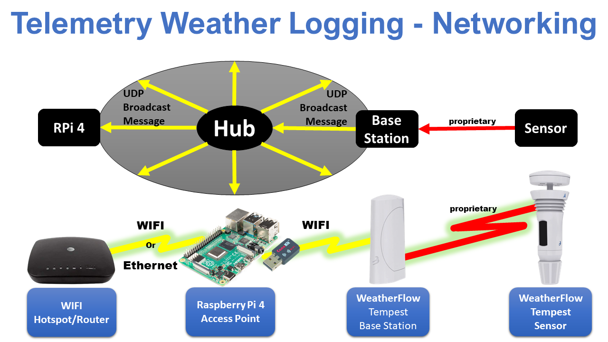

# Telemetry Weather Logging

The Telemetry Weather Logger captures weather/environment data using a [WeatherFlow Tempest](https://weatherflow.com/tempest-weather-system/) weather station.

## **Under Construction**

## Motivation

Integrate weather data with vehicle engine and location data for better, more accurate analytics.

At higher speeds, wind speed and direction relative to vehicle motion become material in fuel usage.  Additionally, changes in vehicle configuration affecting wind resistance can be inferred by changes in fuel usage.

## Context

Coming soon...

## Features

* Collects all weather data provided by [WeatherFlow Tempest](https://weatherflow.com/tempest-weather-system/) weather station.
* ```WeatherReports``` class can be used independently to collect weather data by custom applications.
* Works with Python 3.10 and newer.
* Raspberry Pi 4 hardware and Raspberry Pi OS target environment.

## Target Weather System

The software is made to work with [WeatherFlow Tempest](https://weatherflow.com/tempest-weather-system/) weather station.

## Logger Usage

```bash
$ uv run -m wthr_logger.wthr_logger --help
usage: wthr_logger.py [-h] [--log_file_directory LOG_FILE_DIRECTORY] [--verbose]
                      [--version]

Telemetry Weather Logger

options:
  -h, --help            show this help message and exit
  --log_file_directory LOG_FILE_DIRECTORY
                        Enable logging and place log files into this directory
  --verbose             Turn DEBUG logging on. Default is off.
  --version             Print version number and exit.
$
```

## ```WeatherReports``` Class Usage

```python
import logging
from wthr_logger.udp import WeatherReports

logger = logging.getLogger("weather_logger")

# Weather Report Iterable
weather_reports = WeatherReports(logger)

for raw_weather_report, weather_report in weather_reports:
    if not weather_report:
        # skipping invalid (None value) data
        continue
    print(weather_report)
```

## Log File

Logging is enabled by setting the log file directory ```--log_file_directory``` in the command line options.  The log file format is the same format used by [Telemetry OBD Logger](https://github.com/thatlarrypearson/telemetry-obd#telemetry-obd-logger-output-data-files).  Downstream processing of data captured by **Telemetry OBD Logger**,  **Telemetry GPS Logger**, **Telemetry IMU Logger**, **Telemetry Weather Logger** and other data sources can be processed using the same analysis tools.

### Format

Records in the log files are separated by line feeds ```<LF>```.  Each record is in JSON format representing the key/value pairs described below under [JSON Fields](#json-fields).

### JSON Fields

#### ```command_name```

The ```command_name``` identifies (```WTHR_<message type>```) the weather message type.  See **Messages** in the [WeatherFlow Tempest UDP Reference - v171](https://weatherflow.github.io/Tempest/api/udp/v171/).  The supported ```command_name```s or message types are:

* ```WTHR_evt_precip```
* ```WTHR_evt_strike```
* ```WTHR_rapid_wind```
* ```WTHR_obs_air```
* ```WTHR_obs_sky```
* ```WTHR_obs_st```
* ```WTHR_device_status```
* ```WTHR_hub_status```

#### ```obd_response_value```

Reflects the key/value pairs returned by the Weather Station.  The actual parsed Weather Station output is contained in the ```obd_response_value``` field as a dictionary (key/value pairs).  That is, ```obd_response_value``` is a field that contains subfields representing a weather record.  The subfield name is the key portion of the subfield.  The subfield value is the value part of the subfield.  Each Weather Station message type has its own unique set of subfield names for data contained in ```obd_response_value```.

See [Examples](#sample-log-data) for subfield names.

```iso_ts_pre``` ISO formatted timestamp taken before the GPS command was processed (```datetime.isoformat(datetime.now(tz=timezone.utc))```).

```iso_ts_post``` ISO formatted timestamp taken after the GPS command was processed (```datetime.isoformat(datetime.now(tz=timezone.utc))```).

### Sample Log Data

In the sample output below, the format has been modified for readability.  Below, the ```<LF>``` refers to Linux line feed and is used as a record terminator.

```bash
$ cd telemetry-wthr/data
$ cat "WTHR-20220706142436-utc.json" 
{
    "command_name": "WTHR_rapid_wind",
    "obd_response_value": {
        "time_epoch": 1657117476,
        "wind_speed": 0.1,
        "wind_direction": 180
    },
    "iso_ts_pre": "2022-07-06T14:24:36.335471+00:00",
    "iso_ts_post": "2022-07-06T14:24:37.656696+00:00"
}<LF>
{
    "command_name": "WTHR_hub_status",
    "obd_response_value": {
        "firmware_revision": "177",
        "uptime": 86625,
        "rssi": -67,
        "timestamp": 1657117479,
        "reset_flags": "BOR,PIN,POR",
        "seq": 8648,
        "radio_version": 25,
        "radio_reboot_count": 1,
        "radio_i2c_bus_error_count": 0,
        "radio_status": 3,
        "radio_network_id": 44007
    },
    "iso_ts_pre": "2022-07-06T14:24:37.656897+00:00",
    "iso_ts_post": "2022-07-06T14:24:40.152302+00:00"
}<LF>
{
    "command_name": "WTHR_device_status",
    "obd_response_value": {
        "timestamp": 1657117495,
        "uptime": 86645,
        "voltage": 2.65,
        "firmware_revision": 165,
        "rssi": -55,
        "hub_rssi": -51,
        "sensor_status": 655362,
        "debug": 0
    },
    "iso_ts_pre": "2022-07-06T14:24:55.655285+00:00",
    "iso_ts_post": "2022-07-06T14:24:56.356387+00:00"
}<LF>
{
    "command_name": "WTHR_obs_st",
    "obd_response_value": {
        "firmware_revision": 165,
        "time_epoch": 1657117495,
        "wind_lull": 0.0,
        "wind_average": 0.07,
        "wind_gust": 0.39,
        "wind_direction": 184,
        "wind_sample_interval": 3,
        "station_pressure": 990.49,
        "air_temperature": 28.46,
        "relative_humidity": 72.59,
        "illuminance": 8127,
        "uv": 1.83,
        "solar_radiation": 68,
        "rain_amount_over_previous_minute": 0.0,
        "precipitation_type": 0,
        "lightning_strike_average_distance": 0,
        "lightning_strike_count": 0,
        "battery": 2.65,
        "report_interval": 1
    },
    "iso_ts_pre": "2022-07-06T14:24:56.356491+00:00",
    "iso_ts_post": "2022-07-06T14:24:56.389156+00:00"
}<LF>
$
```

## Weather Station Configuration

Computers wishing to receive weather data from a WeatherFlow Tempest need to be on the same LAN (local area network) as the base station.  The following network context diagram provides two network views.  The first view shows the base station sending UDP broadcast messages to all computers on the local network.  Any computers on the LAN actively listening for broadcast messages on a specific port will process these messages.  Otherwise, the messages will be discarded.



The second view shows more of a hardware view.  Weather data originates from WeatherFlow Tempest sensors and is transmitted to a WeatherFlow Tempest base station via a proprietary communications method.  Using a smart phone application, the base station is configured to use WIFI provided by the computer running this software, a Raspberry Pi 4 Model B.  This Raspberry Pi provided local area network behaves like a normal WIFI/hotspot/router that may or may not be connected via Ethernet to the Internet through an optional WIFI/hotspot/router.

This method is being used for automotive weather data gathering.  Configuring a WIFI Access Point on a Raspberry Pi 3, 4 or 5 running ```Debian 12 bookworm``` is tricky because, in this latest release of Raspberry Pi, network configuration has been dramatically changed to a new configuration subsystem called [Network Manager](https://networkmanager.dev/).   More rough spots need to be smoothed out. **Beware - WIFI access point creation instructions found on the Internet often refer to the old way of configuring networks.**

Follow the instruction found in [Configuring Raspberry Pi WIFI/Hotspot/Router](docs/wifi-hotspot-router.md).  Once you have a hotspot up and running, the weather station needs to be reconfigured/configured to work with the in-vehicle hotspot.  Follow the instructions provided by [WeatherFlow](https://tempest.earth/).

## Weather Station Vehicle Mounting

Vehicle mounting requires some thought and creativity.  Here are some [Mounting Ideas](docs/vehicle-mounting.md).

## Known Problems

## Known Limitations

## License

[MIT](LICENSE.md)
