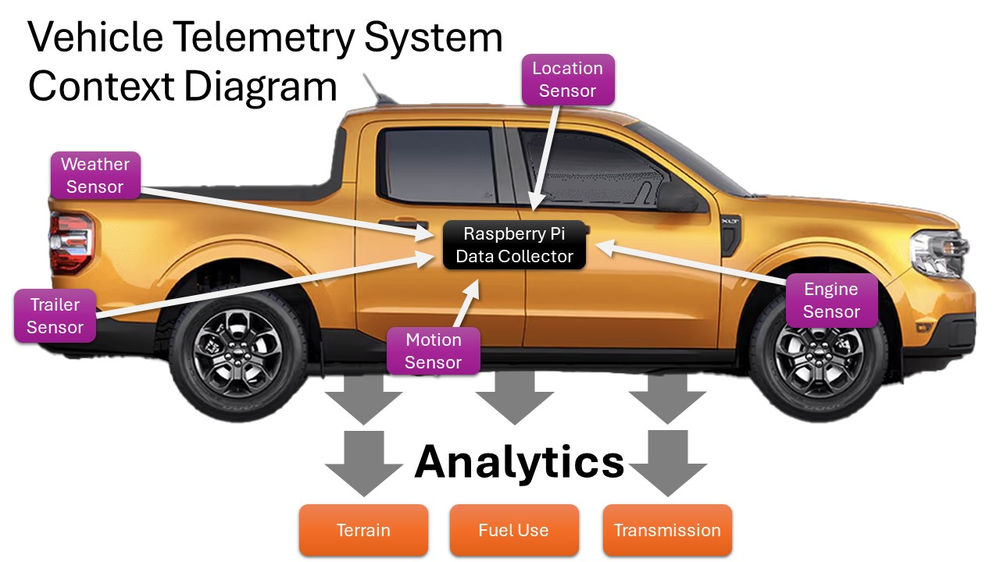

# Vehicle Telemetry System

System for collecting and processing motor vehicle data using included sensor modules.

## **UNDER CONSTRUCTION - REPOSITORY INTEGRATION WORK IS STILL ON-GOING**

The following repositories have been combined to create this repository:

- **Vehicle Sensor Modules**
  - [engine](https://github.com/thatlarrypearson/telemetry-obd) (OBD)
  - [location](https://github.com/thatlarrypearson/telemetry-gps) (GPS)
  - [motion](https://github.com/thatlarrypearson/telemetry-imu) (IMU)
  - [weather](https://github.com/thatlarrypearson/telemetry-wthr) (WTHR)
  - [trailer](https://github.com/thatlarrypearson/telemetry-trailer-connector) (TRLR)
- **Common Functions**
  - [Common utilities](https://github.com/thatlarrypearson/telemetry-utility) (UTILITY)
  - [Audit Capabilities](https://github.com/thatlarrypearson/telemetry-counter) (COUNTER)
- **Data Management Analysis**
  - [Combine JSON records into CSV records](https://github.com/thatlarrypearson/telemetry-obd-log-to-csv) (JSON2CSV)
  - [Notebook Data Analysis](https://github.com/thatlarrypearson/telemetry-analysis) (ANALYSIS)

Moving forward, module development will be in this repository.  Development in the original repositories has stopped.

## Project Summary and Purpose

I started this project thinking that I was better at selecting transmission gears for improved fuel economy than the engine/transmission controller.  Now I'm not so sure my brain can select gears for fuel mileage better than an algorithm.  However, a better algorithm should be attainable especially in windy or hilly/mountainous environments.  A better algorithm should also be able to do better with changes in vehicle loading (cargo).

The gear selection hypothesis led to other questions that look suspiciously like functional requirements.

As a driver, I want to know how my driving choices affect fuel use so that I can make rational tradeoffs between fuel use and:

- transmission gear selection
- drive time
- wind and temperature
- elevation
- route
- speed
- cargo/loading
- vehicle (and trailer) modifications
- traffic congestion (lights and idling)
- acceleration rates

The first step involved creating a data collection environment and then adding sensors to collect the data.  After collecting hours of driving data, data analysis work began to:

- identify software issues
- (in)validate assumptions
  - fuel use spikes in Diesel engines using DEF for emissions control
  - engine reported fuel use compared to filling up at the pump
    - direct fuel use reporting (FUEL_RATE and FUEL_RATE_2)
    - other (calculations involving MAF, ENGINE_LOAD and other stuff)
  - gear identification using Kernel Density Estimation (KDE) extrema
  - error calculations on identified gears
- validate data by comparing similar data from different sources
  - GPS distance traveled (```haversine```) versus odometer versus rate (```SPEED```) times time (```iso_ts_post``` - ```iso_ts_pre```) equals distance
  - generate videos of how SPEED/RPM changes over time overlaid on calculated gears
  - fuel at the pump (fill-ups) compared to fuel consumed reported by the engine controller

Additionally, work has begun to estimate gallons of fuel remaining in fuel tank based on the percentage of fuel the engine controller reports is still in the tank.  It is unlikely that the percentage provided through the OBD interface is linear with respect to the actual fuel use compared to the actual volume of fuel held in the tank.  Temperature also affects fuel volume and this needs to be taken into account.



Five sensors are currently supported:

- engine (OBD II interface)
- location (GPS)
- motion (9 DOF [IMU](https://en.wikipedia.org/wiki/Inertial_measurement_unit))
- weather ([Weatherflow Tempest](https://weatherflow.com/tempest-weather-system/) weather station)
- trailer (7-pin trailer connector)

## Modules - Sensors, Common Functions, Data Management, Data Analysis and Raspberry Pi Configuration

- **Vehicle Sensor Modules**
  - [engine](./README-engine.md) (OBD)
  - [location](./README-location.md) (GPS)
  - [motion](./README-motion.md) (IMU)
  - [weather](./README-weather.md) (WTHR)
  - [trailer](./README-trailer.md) (TRLR)

- **Common Functions**
  - [utilities](./README-utility.md) (UTILITY)
  - [audit](./README-audit.md) (COUNTER)

- **Data Aggregation and Analysis**
  - [aggregation](./README-aggregation.md) (JSON2CSV)
  - [notebooks](./README-notebooks.md) (ANALYSIS)

- **Hardware**
  - Raspberry Pi 4/5
  - Waveshare NEO-M8T GNSS USB
  - Unexpected Maker FeatherS3
  - Adafruit 9-DOF Orientation IMU Fusion Breakout - BNO085 (BNO080) - STEMMA QT / Qwiic PID: 4754
  - ADS1015 12-Bit ADC - 4 Channel with Programmable Gain Amplifier - STEMMA QT / Qwiic PID: 1083
  - [Trailer Connector](./README-trailer.md)
  - [WeatherFlow Tempest](https://weatherflow.com/tempest-weather-system/)
  - [Witty Pi 4](./docs/WittyPi4-README.md)

- **Data Collection**

    This section covers preparing a Raspberry Pi system for in vehicle use as a headless data collection system.

  - [Raspberry Pi Data Collector](./README-rpdc.md) Configuration

## Data

Data from each sensor is captured by one vehicle mounted Raspberry Pi (3, 4 or 5) SBC (single board computer).  The data file naming convention enables aggregating data files from each type of sensor being used such that:

- file system directory structure separates multiple Raspberry Pi's by ```hostname``` to support data collection for a fleet of vehicles
- data file naming conventions identify
  - ```sensor```, abbreviated version of the sensor type
  - ```trip```, a period of time starting when the Raspberry Pi boots and ends when the Raspberry Pi halts (graceful or otherwise)
  - ```session```, a counter starting with 0 that increments each time a sensor collection program restarts during a ```trip```
- the engine sensor collection program adds a VIN (vehicle identification number) to its data file name but otherwise conforms to the aforementioned data file naming conventions
  - this VIN is used by analysis programs to identify and aggregate all of the data files associated with an individual ```trip``` into individual data files associated with that VIN's trip

Aggregating data files requires:

- identifying the list of files for a specific ```trip```
- reading all of the records into a list
- sorting the list of all records from all sensors by before and after time stamps
- writing the sorted list to a new file with a name containing the ```hostname```, ```trip``` and VIN.

[Data File Naming Conventions](./README-audit/#data-file-naming-conventions) and how to [Add Additional Sensors](./README-audit.md/#adding-additional-sensors) are described in the [Audit](./README-audit.md) module.

### Data File Format

Output data files are in a hybrid format.  Data files contain records separated by line feeds (```LF```) or carriage return and line feeds (```CF``` and ```LF```).  The records themselves are formatted in JSON.

All sensor generated data conforms to the following standard format:

```json
{
  "command_name": STRING,
  "obd_response_value": (LIST|DICTIONARY|FLOAT|INTEGER|STRING|PINT_ENCODED_VALUE|None|"no response"),
  "iso_ts_pre": ISO_FORMATTED_TIMESTAMP,
  "iso_ts_post": ISO_FORMATTED_TIMESTAMP
}
```

```obd_response_value``` data types lists and dictionaries can include embedded ```(LIST|DICTIONARY|FLOAT|INTEGER|STRING|PINT_ENCODED_VALUE|None|"no response")``` as values.

### JSON Fields

- ```command_name```
  
  Sensor provided _command_ name in string format.  Sensor provided names must be unique such that each time a ```command_name``` is used, the data in the ```obd_response_value``` is consistent in format and meaning.

- ```obd_response_value```

  Response values returned by sensors.
  
  - When a sensor has no response, the response can be ```"no response"``` or ```None```.
  
  - _PINT_ENCODED_VALUES_ are serialized [Pint](https://pint.readthedocs.io/en/stable/) objects.  As strings in JSON fields, they look like ```"25 degC"``` and ```"101 kilopascal"```.
  - _FLOAT_ values represent floating point numbers.
  - _INTEGER_ values represent integers.
  - _STRING_ is just a ```str``` Python object type.  There may be rare circumstances where they were encoded as Python ```bytearray``` objects.
  - _LIST_ is a Python ```list``` object.  List items may be any of the accepted data types/objects.
  - _DICTIONARY_ is a Python ```dict``` object.  Keys must be of type ```str```.  The associated value can be any of the accepted data types/objects.

    Some```obd_response_values``` are a list or a dictionary.  The values within these lists/dictionaries can also be Pint values.  This works just fine in JSON but the code reading these output files will need to be able to manage embedded lists within the response values.  [Telemetry OBD Data To CSV File](https://github.com/thatlarrypearson/telemetry-obd-log-to-csv) contains two programs, ```obd_log_evaluation``` and ```obd_log_to_csv```, providing good examples of how to handle multiple return values.

- ```iso_ts_pre```

  ISO formatted timestamp taken before sensor data was requested (```datetime.isoformat(datetime.now(tz=timezone.utc))```).  This value must always be filled in by the vehicle mounted Raspberry Pi (3, 4 or 5) SBC (single board computer) to ensure that all records are collected using the same time clock.

- ```iso_ts_post```

  ISO formatted timestamp taken after sensor data was requested (```datetime.isoformat(datetime.now(tz=timezone.utc))```). This value must always be filled in by the vehicle mounted Raspberry Pi (3, 4 or 5) SBC (single board computer) to ensure that all records are collected using the same time clock.

### Pint Encoded Values

[Pint](https://pint.readthedocs.io/en/stable/) encoded values are strings with a numeric part followed by the unit.  For example, ```"25 degC"``` represents 25 degrees Centigrade.  ```"101 kilopascal"``` is around 14.6 PSI (pounds per square inch).  Pint values are used so that the units are always kept with the data and so that unit conversions can easily be done in downstream analysis software.  These strings can be deserialized back to Pint objects for use in Python programs.

### Example Data

Here are some examples of records pulled from multiple JSON data files:

```json
{
  "command_name": "PIDS_A",
  "obd_response_value": [
    true, false, true, true, true, true, true, false, false, false, true, true, true, true, true, false, true, false, true, false, true, false, false, false, false, false, false, true, false, false, true, true
  ],
  "iso_ts_pre": "2023-08-31T15:19:25.365217+00:00",
  "iso_ts_post": "2023-08-31T15:19:25.416874+00:00"
}
{
  "command_name": "STATUS",
  "obd_response_value": [
    "Test MISFIRE_MONITORING: Available, Complete",
    "Test FUEL_SYSTEM_MONITORING: Available, Complete",
    "Test COMPONENT_MONITORING: Available, Complete"
  ],
  "iso_ts_pre": "2023-08-31T15:19:25.417284+00:00",
  "iso_ts_post": "2023-08-31T15:19:25.467059+00:00"
}
{
  "command_name": "FREEZE_DTC",
  "obd_response_value": "no response",
  "iso_ts_pre": "2023-08-31T15:19:25.467393+00:00",
  "iso_ts_post": "2023-08-31T15:19:25.576930+00:00"
}
{
  "command_name": "ENGINE_LOAD",
  "obd_response_value": "34.11764705882353 percent",
  "iso_ts_pre": "2023-08-31T15:19:25.627322+00:00",
  "iso_ts_post": "2023-08-31T15:19:25.677821+00:00"
}
{
  "command_name": "COOLANT_TEMP",
  "obd_response_value": "65 degree_Celsius",
  "iso_ts_pre": "2023-08-31T15:19:25.679476+00:00",
  "iso_ts_post": "2023-08-31T15:19:25.727384+00:00"
}
{
  "command_name": "gyroscope",
  "obd_response_value": {
    "record_number": 1098,
    "x": -0.0175781,
    "y": -0.0117188,
    "z": 0.00195313
  },
  "iso_ts_pre": "2023-11-08T19:35:29.921369+00:00",
  "iso_ts_post": "2023-11-08T19:35:29.925869+00:00"
}
{
  "command_name": "GNGNS",
  "obd_response_value": {
    "time": "16:11:28",
    "lat": "29.5014915",
    "NS": "N",
    "lon": "-98.4308333333",
    "EW": "W",
    "posMode": "AA",
    "numSV": "16",
    "HDOP": "0.73",
    "alt": "216.1",
    "sep": "-22.8",
    "diffAge": null,
    "diffStation": null
  },
  "iso_ts_pre": "2023-11-08T19:35:29.955941+00:00",
  "iso_ts_post": "2023-11-08T19:35:29.958733+00:00"
}
{
  "command_name": "WTHR_rapid_wind",
  "obd_response_value": {
    "time_epoch": 1723494283,
    "wind_speed": 1.02,
    "wind_direction": 236
  },
  "iso_ts_pre": "2024-08-12T20:24:09.866113+00:00",
  "iso_ts_post": "2024-08-12T20:24:09.866529+00:00"
}
```

### Aggregating Data From Multiple Sensors

This method works because all of the timestamps used in the process described below come from the same computer's clock and bracket (before and after) the time the data was collected from the sensors.

```bash
$ python -m obd_log_to_csv.json_data_integrator --help
usage: json_data_integrator [-h] [--base_path BASE_PATH] --hostname HOSTNAME --boot_count BOOT_COUNT [--version VERSION] [--verbose]

Telemetry JSON Data Integrator

options:
  -h, --help            show this help message and exit
  --base_path BASE_PATH
                        BASE_PATH directory variable. Defaults to /home/username/telemetry-data/data
  --hostname HOSTNAME   The hostname of the computer where the data was collected.
  --boot_count BOOT_COUNT
                        A counter used to identify the number of times the data collection computer booted since telemetry-counter was installed and configured.
  --version VERSION     Returns version and exit.
  --verbose             Turn verbose output on. Default is off.
$
```

At runtime, each sensor generates its own data file.  Integrating these files into a new **```integrated```** data file requires:

- create an empty Python dictionary called **```target_dictionary```**
- identify all data files sharing a common **```HOST_ID```** and **```boot_count_string```**
- read each identified file record by record
  - translate each record from JSON to a Python dictionary called **```data_record```**
  - set **```key_value```** to the list [```json_record["iso_ts_pre"]```, ```json_record["iso_ts_post"]```, - ```json_record["command_name"]```]
  - set **```target_dictionary```**[**```key_value```**] to **```data_record```**
- **sort** (ascending) the **```target_dictionary```** on its key
- for each item in **```target_dictionary```**, convert the **```target_dictionary```** ```value``` to JSON format and write that as a line to an output file.

When all three of the JSON record fields in two different records have the same values, then one of the records is a duplicate record.   Duplicate records are automatically removed in the process described above.

Integrated data file names are in the following format:

- f"{base_path}/{HOST_ID}/{HOST_ID}-{boot_count_string}-integrated-{vin}.json"

Where:

- **```base_path```** defaults to the home directory (```${HOME}```) of the vehicle mounted Raspberry Pi (3, 4 or 5) SBC (single board computer) user executing the data collection module(s).
- **```HOST_ID```** is the host name of the vehicle mounted Raspberry Pi (3, 4 or 5) SBC (single board computer).  See bash shell command ```hostname```.
- **```boot_count_string```** is a zero padded string containing a number that is incremented every time the vehicle mounted Raspberry Pi (3, 4 or 5) SBC (single board computer) is booted.
- **```vin```** is the vehicle manufacturer's Vehicle Identification Number or VIN

## Python Project Software Build and Installation

For this project, [```uv```](https://github.com/astral-sh/uv) is used to

- Install Python
- Create and manage the virtual Python runtime environment
- Create a Python package and install it into the virtual environment
- Run specific Python modules installed in the virtual environment

Install ```git``` before cloning the software from this [github repository](https://github.com/thatlarrypearson/vehicle-telemetry-system).  For a Windows or Mac ```git``` installation, go to [Microsoft Learn - Install and set up Git](https://learn.microsoft.com/en-us/devops/develop/git/install-and-set-up-git) and follow their instructions.

Use the ```apt``` package management system to install ```git``` on Debian Linux variants including Raspberry Pi, Ubuntu and Linux Mint.

```bash
apt install git
```

For Windows (and Mac) users, [GitHub Desktop](https://desktop.github.com/download/) is a GUI interface I use myself to simplify my development workflow.

To install [```uv```](https://github.com/astral-sh/uv), follow these [```uv``` install instructions](https://docs.astral.sh/uv/getting-started/installation/)

After installing and testing [```uv```](https://github.com/astral-sh/uv), use [```git```](https://git-scm.com/downloads) to [clone this repository](https://github.com/thatlarrypearson/vehicle-telemetry-system) onto your local target computer.

```bash
# Clone the git repository
git clone https://github.com/thatlarrypearson/vehicle-telemetry-system.git
```

Next, use [```uv```](https://github.com/astral-sh/uv) to prepare the virtual Python environment, install the needed Python version (if needed), install the required external Python libraries, build [Vehicle Telemetry System software](https://github.com/thatlarrypearson/vehicle-telemetry-system), install [Vehicle Telemetry System software](https://github.com/thatlarrypearson/vehicle-telemetry-system) and run a simple test of the newly installed software.

```bash
# get into the cloned repository directory
cd vehicle-telemetry-system

# create the virtual Python environment with the needed libraries
# by using the ```dependencies``` in the ```pyproject.toml``` file
uv sync

# Activate the Python Virtual Environment

# Windows PowerShell
.\.venv\Scripts\activate

# Linux/Mac bash Shell
source .venv/bin/activate

# When the Python Virtual Environment is activated, the prompt will change.

# Windows PowerShell
#     - (vehicle-telemetry-system) PS C:\Users\username\vehicle-telemetry-system >

# Linux/Mac bash Shell
#     - (vehicle-telemetry-system) user@hostname:~/vehicle-telemetry-system $

uv build .

# Developers and data analysts install the software such that changes are reflected
# in the virtual runtime environment automatically.
uv pip install -e .

# For production use, install the software as a Python package.
uv pip install dist/vehicle_telemetry_system-0.5.0-py3-none-any.whl
```

## Simple Tests Validating Build and Installation

Before running any module, be sure to activate the Python virtual environment.

```bash
# get into the cloned repository directory
cd vehicle-telemetry-system

# Activate the Python Virtual Environment

# Windows PowerShell
.\.venv\Scripts\activate

# Linux/Mac bash Shell
source .venv/Scripts/activate
```

Once the Python virtual environment is activated, get the usage from each of the modules as shown below.  If errors occur, resolve them before continuing.

### Engine (```telemetry_obd.obd_logger```)

```bash
uv run -m telemetry_obd.obd_logger --help
```

Results should look something like the following:

```bash
usage: obd_logger.py [-h] [--config_file CONFIG_FILE] [--config_dir CONFIG_DIR] [--full_cycles FULL_CYCLES]
                     [--timeout TIMEOUT] [--logging] [--no_fast] [--start_cycle_delay START_CYCLE_DELAY] [--verbose]
                     [--version]
                     [base_path]

Telemetry OBD Logger

positional arguments:
  base_path             Relative or absolute output data directory. Defaults to 'C:\Users\username\telemetry-data\data'.

options:
  -h, --help            show this help message and exit
  --config_file CONFIG_FILE
                        Settings file name. Defaults to '<vehicle-VIN>.ini' or 'default.ini'.
  --config_dir CONFIG_DIR
                        Settings directory path. Defaults to './config'.
  --full_cycles FULL_CYCLES
                        The number of full cycles before a new output file is started. Default is 5000.
  --timeout TIMEOUT     The number seconds before the current command times out. Default is 1.0 seconds.
  --logging             Turn on logging in python-obd library. Default is off.
  --no_fast             When on, commands for every request will be unaltered with potentially long timeouts when the
                        car doesn't respond promptly or at all. When off (fast is on), commands are optimized before
                        being sent to the car. A timeout is added at the end of the command. Default is off.
  --start_cycle_delay START_CYCLE_DELAY
                        Delay in seconds before first OBD command in cycle. Default is 0.
  --verbose             Turn verbose output on. Default is off.
  --version             Print version number and exit.
```

### Location (```gps_logger.gps_logger```)

```bash
uv run -m gps_logger.gps_logger --help
```

Results should look something like the following:

```bash
usage: gps_logger.py [-h] [--log_file_directory LOG_FILE_DIRECTORY]
                     [--serial SERIAL] [--verbose] [--version]

Telemetry GPS Logger

options:
  -h, --help            show this help message and exit
  --message_rate MESSAGE_RATE
                        Number of whole seconds between each GPS fix.  Defaults to 1.
  --serial SERIAL       Full path to the serial device where the GPS can be found, defaults to /dev/ttyACM0
  --verbose             Turn DEBUG logging on. Default is off.
  --version             Print version number and exit.
```

### Motion (```imu_logger.imu_logger```)

```bash
uv run -m imu_logger.imu_logger --help
```

Results should look something like the following:

```bash
WARNING:root:USB Serial Device <Unexpected Maker FeatherS3> NOT found
usage: imu_logger.py [-h] [--usb] [--serial_device_name SERIAL_DEVICE_NAME] [--no_wifi]
                     [--udp_port_number UDP_PORT_NUMBER] [--verbose] [--version]
                     [base_path]

Telemetry IMU Logger

positional arguments:
  base_path             Relative or absolute output data directory. Defaults to 'C:\Users\username\telemetry-data\data'.

options:
  -h, --help            show this help message and exit
  --usb                 CircuitPython microcontroller connects via USB is True. Default is False.
  --serial_device_name SERIAL_DEVICE_NAME
                        Name for the hardware IMU serial device. Defaults to None
  --no_wifi             CircuitPython microcontroller does NOT use WIFI to connect. Default is False
  --udp_port_number UDP_PORT_NUMBER
                        TCP/IP UDP port number for receiving datagrams. Defaults to '50219'
  --verbose             Turn DEBUG logging on. Default is off.
  --version             Print version number and exit.
```

### Weather (```wthr_logger.wthr_logger```)

```bash
uv run -m wthr_logger.wthr_logger --help
```

Results should look something like the following:

```bash
usage: wthr_logger.py [-h] [--log_file_directory LOG_FILE_DIRECTORY] [--verbose]
                      [--version]

Telemetry Weather Logger

options:
  -h, --help            show this help message and exit
  --log_file_directory LOG_FILE_DIRECTORY
                        Enable logging and place log files into this directory
  --verbose             Turn DEBUG logging on. Default is off.
  --version             Print version number and exit.
```

### Trailer (```trlr_logger.trlr_logger```)

```bash
uv run -m trlr_logger.trlr_logger --help
```

Results should look something like the following:

```bash
usage: trlr_logger.py [-h] [--udp_port_number UDP_PORT_NUMBER] [--log_file_directory LOG_FILE_DIRECTORY]
                      [--verbose] [--version]
                      [base_path]

Telemetry Trailer Connector UDP Logger

positional arguments:
  base_path             Relative or absolute output data directory. Defaults to '/home/username/telemetry-data/data'.

options:
  -h, --help            show this help message and exit
  --udp_port_number UDP_PORT_NUMBER
                        TCP/IP UDP port number for receiving datagrams. Defaults to '50223'
  --log_file_directory LOG_FILE_DIRECTORY
                        Place log files into this directory - defaults to /home/username/telemetry-data/data
  --verbose             Turn DEBUG logging on. Default is off.
  --version             Print version number and exit.
```

## Installing On The Raspberry Pi Data Collector Target System

Raspberry Pi 4 with 4 GB RAM (or more) and with a 32 GB (or more) SD card.

## Target Hardware

The software is made to work with [WeatherFlow Tempest](https://weatherflow.com/tempest-weather-system/) weather station.  The software is being tested on a Raspberry Pi 4 running Raspberry Pi OS ```bookworm```.

First, complete the [Python Project Software Installation](#python-project-software-build-and-installation) instructions.

Next, complete the [Raspberry Pi Data Collector](./README-rpdc.md) instructions.

Certain modules require configuration changes to [Raspberry Pi OS](https://www.raspberrypi.com/software/) to operate correctly.  No need to configure for modules not being used.

## Manufacturer Warranty Information

The owners manuals for 2019 Ford EcoSport and other vehicles have the following statement or something similar with respect to aftermarket OBD devices:

- "Your vehicle has an OBD Data Link Connector (DLC) that is used in conjunction with a diagnostic scan tool for vehicle diagnostics, repairs and reprogramming services. Installing an aftermarket device that uses the DLC during normal driving for purposes such as remote insurance company monitoring, transmission of vehicle data to other devices or entities, or altering the performance of the vehicle, may cause interference with or even damage to vehicle systems. We do not recommend or endorse the use of aftermarket plug-in devices unless approved by Ford. The vehicle Warranty will not cover damage caused by an aftermarket plug-in device."

You use this software at your own risk.

## License

[MIT License](./LICENSE.md)
